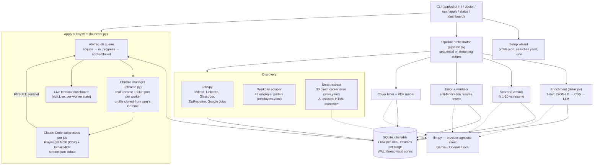

# ApplyPilot Reverse-Engineering: HLD, LLD, and a Fix Plan for Career Agent

*Source analyzed: https://github.com/Pickle-Pixel/ApplyPilot (AGPL-3.0, ~10,400 LOC Python,
HEAD `4a8d521`, cloned 2026-09-01). Claims "1,000 applications in 2 days, fully autonomous."*

---

## 1. Executive summary — why ApplyPilot succeeds where Career Agent fails

ApplyPilot's core insight is that **form-filling is not a parsing problem, it is a judgment
problem** — and it therefore refuses to hand-code a form filler at all. For every job, it
spawns a **fresh Claude Code CLI session wired to a real Chrome browser via a Playwright MCP
server**, hands it a ~600-line "application playbook" prompt containing the candidate's
profile, tailored resume text, salary decision tree, screening-question strategy, and CAPTCHA
recipes, and lets the agent navigate whatever form it finds. The agent reports back through a
one-line sentinel protocol (`RESULT:APPLIED`, `RESULT:CAPTCHA`, `RESULT:FAILED:reason`) that
the Python orchestrator parses from stdout.

Five design decisions make it work as a product:

1. **Agentic form navigation instead of deterministic fillers.** ATS form diversity
   (Workday, Lever, iCIMS, Taleo, Greenhouse, thousands of custom career sites) is unbounded;
   any hand-coded filler is permanently behind. An LLM agent driving accessibility snapshots
   generalizes to forms nobody wrote code for. This is the single biggest difference from
   Career Agent's hand-coded Greenhouse filler.
2. **A real Chrome with a real identity.** It launches the system Chrome (not Playwright's
   bundled Chromium) with `--remote-debugging-port`, using a worker profile **cloned from the
   user's actual Chrome profile** — real fingerprint, real cookies, existing logged-in
   sessions. Most bot-detection and login walls simply never fire.
3. **A failure taxonomy, not a success requirement.** Every outcome is classified
   (`expired`, `captcha`, `sso_required`, `not_eligible_location`, `login_issue`, …) and
   split into *permanent* (never retry, `apply_attempts=99`) vs *retryable* (bounded by
   `max_apply_attempts`). A failed application costs one job, not the queue. Throughput at
   scale comes from cheap, classified failure — not from every application succeeding.
4. **Route around what you can't automate.** Config-driven blocklists: blocked sites
   (Glassdoor, Google), manual-only ATS domains (unsolvable CAPTCHAs → flagged `manual` for
   the human), blocked SSO domains (agent told to bail immediately with
   `RESULT:FAILED:sso_required`). Optional CapSolver API for the CAPTCHAs that *are* solvable.
5. **Answer questions strategically instead of parking.** The prompt divides screening
   questions into *hard facts* (work auth, citizenship, criminal history — answer only from
   profile, never guess) and everything else (skills → answer confidently; open-ended → write
   2–3 job-specific sentences). Unknown questions never halt the pipeline; at worst one job
   fails with a reason.

Cost architecture matters too: bulk stages (scoring, tailoring, cover letters) run on
**Gemini free tier**; the expensive capable agent (Claude) is spent only on the ~5% of the
problem that is genuinely hard — live form navigation.

---

## 2. High-Level Design

### 2.1 Component map



### 2.2 The six stages

| Stage | Module | Mechanism | LLM used |
|---|---|---|---|
| 1. Discover | `discovery/{jobspy,workday,smartextract}.py` | JobSpy library (5 boards) + Workday portal API scraping + direct-site scraping with AI extraction fallback; dedupe by URL primary key | Gemini (smart-extract only) |
| 2. Enrich | `enrichment/detail.py` | Visit each job URL; extract `full_description` + `application_url` via JSON-LD → CSS selectors → LLM cascade (cheapest first) | Gemini (tier 3 only) |
| 3. Score | `scoring/scorer.py` | One prompt per job: resume + description → `SCORE/KEYWORDS/REASONING` line format, parsed with regex | Gemini |
| 4. Tailor | `scoring/tailor.py` + `validator.py` | Per-job resume rewrite; `resume_facts` from profile preserved verbatim; validator retries on fabrication/banned words | Gemini |
| 5. Cover letter | `scoring/cover_letter.py` + `pdf.py` | Per-job letter; both rendered to PDF for upload | Gemini |
| 6. Auto-apply | `apply/*` | Claude Code + Playwright MCP against real Chrome; submits, classifies outcome | **Claude** |

Key HLD properties:

- **Single-table state machine.** One `jobs` row per URL; each stage fills its own columns
  (`full_description`, `fit_score`, `tailored_resume_path`, `apply_status`, …). "Pending for
  stage N" = "stage N's column IS NULL AND stage N−1's is not." Stages are therefore
  independently runnable, resumable, and idempotent — `applypilot run score` just re-queries.
  All columns are created up-front (plus an `_ALL_COLUMNS` registry for migrations), so there
  is no migration-ordering problem.
- **Streaming mode.** `run --stream` runs stages concurrently; a stage completes when its
  upstream is done and it has no pending rows — a poor-man's dataflow pipeline over the DB.
- **Decoupled apply loop.** `applypilot apply --continuous` polls the DB forever; discovery
  can keep feeding it from another process. Same DB-mediated decoupling Career Agent already
  has with its two `run_state` loops.

---

## 3. Low-Level Design — the apply subsystem (the part Career Agent is missing)

### 3.1 Job acquisition (queue semantics)

`acquire_job()` in `launcher.py`:

- `BEGIN IMMEDIATE` transaction → atomic claim under multi-worker concurrency.
- Eligibility: `tailored_resume_path IS NOT NULL` AND `apply_status IS NULL OR 'failed'`
  AND `apply_attempts < max` AND `fit_score >= min_score` AND site/URL not in blocklists.
- Ordered `fit_score DESC` — best jobs first, so a budget/interrupt still spends effort optimally.
- Manual-ATS URLs are marked `apply_status='manual'` and skipped (human queue).
- Claim = `apply_status='in_progress'`, `agent_id='worker-N'`, `last_attempted_at=now`.
- `release_lock()` reverts an `in_progress` claim without consuming an attempt (used for
  skip/Ctrl+C/crash paths).

### 3.2 Chrome lifecycle (`chrome.py`)

- **Per-worker isolation:** CDP port `9222 + worker_id`, Chrome profile dir
  `chrome-workers/worker-N`, working dir wiped per job (`reset_worker_dir`).
- **Profile cloning:** first run copies the *user's real Chrome profile* (skipping caches,
  ShaderCache, Service Worker, locks) — inherits cookies, sessions, fingerprint. Subsequent
  workers clone from an existing worker profile.
- **Preference patching before each launch:** `exit_type=Normal` (kills the "Restore
  pages?" nag that would confuse the agent), password manager off, autofill off.
- **Launch flags as a safety layer:** `--deny-permission-prompts`,
  `--use-fake-ui-for-media-stream`, `--disable-notifications` — camera/mic/location prompts
  can never appear, complementing the prompt-level "NEVER grant permissions" rule.
- **Zombie hygiene:** before binding a port, kill whatever is listening on it
  (netstat/taskkill on Windows, lsof/killpg on Unix); process-*tree* kill everywhere
  (Chrome spawns 10+ children); `atexit` sweep of all workers and ports.

### 3.3 The agent invocation (`run_job`)

```
claude --model sonnet -p \
  --mcp-config .mcp-apply-N.json \        # playwright MCP → --cdp-endpoint=http://localhost:922N, plus gmail MCP
  --permission-mode bypassPermissions \
  --no-session-persistence \
  --disallowedTools "mcp__gmail__<all mutating/label tools>" \
  --output-format stream-json --verbose -
```

- Prompt is piped on stdin; stdout is **stream-json**, parsed line by line:
  - `assistant`/`text` blocks → appended to transcript log;
  - `assistant`/`tool_use` blocks → humanized one-liner (`browser_fill_form (12 fields)`)
    → live dashboard "last action" + action counter;
  - `result` message → token usage + `total_cost_usd` + turn count → running cost display.
- Hard **300 s timeout**, then process-tree kill. Every job writes its own transcript file
  (`claude_<ts>_wN_<site>.txt`) — per-job forensics for free.
- Gmail MCP is included **read-mostly** (send + search + read allowed; drafts, deletes,
  labels, filters disallowed) — used for email-verification codes during account creation
  and for "email your resume to…" postings.
- Env scrubbing: `CLAUDECODE` / `CLAUDE_CODE_ENTRYPOINT` removed so the child session
  doesn't think it's nested.

### 3.4 The prompt (`prompt.py`) — the actual "product"

The prompt is the largest and most valuable artifact in the repo. Structure:

| Section | Content |
|---|---|
| JOB / FILES | URL, title, score; absolute paths to resume + cover-letter PDFs, **copied to a clean filename** (`First_Last_Resume.pdf` — recruiters see it) |
| RESUME TEXT | plain-text tailored resume, for filling text fields |
| APPLICANT PROFILE | every profile field flattened: contact, address, links, work auth, salary, availability, EEO defaults, plus standard answers ("Age 18+: Yes", "How heard: Online Job Board") |
| MISSION | "You are autonomous… if instructions don't cover it, figure it out" — explicit permission to improvise |
| HARD RULES | never lie about citizenship/auth/criminal/education/clearance; name handling (legal vs preferred) |
| NEVER-DO list | camera/mic/biometric → fail; freelance marketplaces → fail; no extensions/downloads/payment info/SSN; each with its own failure code |
| LOCATION CHECK | run *first*, decision table over remote/hybrid/onsite × acceptable-cities list → early `not_eligible_location` before wasting form time |
| SALARY | decision tree: posted range → midpoint; senior titles → floor raise; currency conversion; hourly = annual/2080 with precomputed examples |
| SCREENING | hard facts from profile only; skills → confident yes within domain; open-ended → 2–3 specific sentences; EEO → decline |
| STEP-BY-STEP | 12 numbered steps: navigate → snapshot → captcha-detect → location check → apply click → login-wall protocol (SSO detection, popup tab handling, signup fallback, email-code retrieval via Gmail MCP) → resume upload ("always delete existing, upload fresh") → **audit ATS-parsed pre-fills** ("the parser is often WRONG") → screening → pre-submit full review → post-submit verification ("thank you" page) → RESULT |
| RESULT CODES | the exact sentinel grammar the orchestrator parses |
| BROWSER EFFICIENCY | snapshot once per page, screenshot for checks (10× cheaper), `browser_fill_form` all fields in one call, keep thinking short — token-cost engineering inside the prompt |
| FORM TRICKS | accumulated field lore: popup tabs, Workday/Lever "upload to pre-fill" pages, stubborn dropdowns/checkboxes, phone-prefix digits, honeypots, placeholder-format matching |
| CAPTCHA | full detect script (ordered: hCaptcha before reCAPTCHA because both use `data-sitekey`; invisible v3/Turnstile detection) + CapSolver createTask→poll→inject recipes per captcha type + manual fallback rules |
| WHEN TO GIVE UP | 3 attempts same page → `stuck`; expired; page error. "Stop immediately. Do not loop." |

Two details worth stealing regardless of architecture: the **dry-run switch is one swapped
paragraph** (fill everything, verify, don't click Submit, report APPLIED-as-dry-run), and
**every give-up path has a machine-readable reason**.

### 3.5 Result handling and failure taxonomy

- Sentinel parse order: `RESULT:APPLIED|EXPIRED|CAPTCHA|LOGIN_ISSUE` → direct status;
  `RESULT:FAILED:<reason>` → reason extracted, cleaned, and *promoted* to a first-class
  status if it's really a category (`captcha`, `expired`, `login_issue`).
- `PERMANENT_FAILURES` set + prefix matching (`site_blocked*`, `cloudflare*`) → written with
  `apply_attempts=99` so the queue never re-picks them. Everything else retries up to
  `max_apply_attempts`.
- No sentinel in output → `failed:no_result_line` (counts as an attempt). Timeout → `failed:timeout`.
- Operator tooling: `--reset-failed`, `--mark-applied URL`, `--mark-failed URL`,
  `--gen --url URL` (writes the exact prompt + MCP config to disk for manual replay of one
  job — the debugging story for a nondeterministic agent).
- Ctrl+C once = kill the Claude processes only → current jobs *skipped* (locks released,
  no attempt consumed); Ctrl+C twice = stop event + kill Chrome everywhere.

### 3.6 Concurrency model

Threads, not asyncio: `ThreadPoolExecutor` of worker loops, each fully isolated by
construction (own CDP port, own Chrome profile, own working dir, own MCP config file, own
log). SQLite handles the shared state with WAL + `busy_timeout=10000` + thread-local
connections + `BEGIN IMMEDIATE` claims. A daemon thread refreshes the rich dashboard at 2 Hz;
worker limit is divided across workers (`limit=10, workers=3` → 4/3/3).

---

## 4. Career Agent vs ApplyPilot

| Dimension | Career Agent (today) | ApplyPilot | Verdict |
|---|---|---|---|
| Discovery | Apify actors (LinkedIn, Naukri) + Greenhouse boards | JobSpy (5 boards) + 48 Workday portals + 30 direct sites | AP wider; CA fine — not the bottleneck |
| Quality gate | 5-dimension LLM verdict vs facts store, `MIN_FACTS_HARD`, `PROMPT_VERSION` + golden tests | Single 1–10 score, regex-parsed | **CA better** — keep it |
| Tailoring | DOCX master template, fact-cited, hallucination guard | Full LLM rewrite + validator, PDF out | Comparable; CA's DOCX markers are safer, AP's PDF is what ATSes want |
| **Apply engine** | Hand-coded Playwright filler, **Greenhouse only**, every other source unconditionally refuses | LLM agent + Playwright MCP + real Chrome, **any form** | **Root cause #1 of CA's failure** |
| Browser | Playwright bundled Chromium, sterile profile | Real Chrome, CDP, profile cloned from the user's | **Root cause #2** — bot walls, no sessions |
| Unknown questions | `NeedsAnswer` **parks the whole worker** until a human answers on the dashboard | Strategic answering (hard facts vs judgment); one job fails at worst | **Root cause #3** — CA throughput → 0 |
| Failure handling | Parked run or generic failure | Taxonomy + permanent/retryable split + per-job transcript + reset/mark tools | AP far ahead |
| CAPTCHA / SSO / login walls | None | Detect scripts + CapSolver + SSO bail-out codes + signup/email-code flow | AP only |
| Kill switch / review | `SUBMISSION_IMPLEMENTED=False` + draft-then-send two-phase review | `--dry-run` flag only; default is fully autonomous | **CA better** — keep the two-phase gate |
| Parallelism | Single apply worker thread | N workers, per-port Chrome isolation | AP ahead; CA doesn't need it yet |
| Cost design | Claude for scoring+tailoring | Gemini free tier for bulk, Claude only for apply | AP's split is the right shape |

### Root causes of Career Agent's application failures

1. **Deterministic filler vs. unbounded form diversity.** `_default_compute_answers` /
   `_default_fill_and_submit` encode one snapshot of one ATS's DOM. Any Greenhouse variant,
   custom question widget, or redesign breaks it — and by design it has no automated tests,
   so breakage is discovered only in production.
2. **Coverage is a single ATS.** Only `job.source == "ats"` can even attempt submission;
   the LinkedIn lane (most of the discovered volume) is an unconditional refusal, and Naukri
   is discovery-only forever. Most of the pipeline's output is undeliverable by construction.
3. **Park-on-unknown starves the queue.** One unanswered screening question stops the entire
   apply worker until a human visits the dashboard. ApplyPilot's insight: most questions
   don't need a human — only *hard facts* do, and those live in the profile.
4. **Sterile browser.** Fresh Chromium = no cookies, no sessions, bot-detection-prone
   fingerprint → login walls and CAPTCHAs that a cloned real-Chrome profile never sees.
5. **No failure vocabulary.** Without `expired/captcha/sso_required/not_eligible` categories
   and a permanent-vs-retryable split, every failure is equally opaque and equally retried
   (or equally fatal) — impossible to operate at any volume.

---

## 5. Fix plan for Career Agent (prioritized)

Guiding principle: **adopt ApplyPilot's apply engine, keep Career Agent's quality gate and
two-phase review.** Career Agent's discovery, hard filter, scored gate, facts store, and
draft-review workflow are all *better* than ApplyPilot's equivalents. The apply layer is the
only part to replace.

### P0 — the agentic apply path (highest impact)

**1. Replace the hand-coded filler with a per-job Claude Code + Playwright MCP agent.**
*Impact: eliminates root causes 1 and 2 in one move. Effort: ~3–5 days.*

- New `apply/agent.py`: build prompt from `candidate_profile.toml` + `career_brief.toml`
  (locations → the LOCATION CHECK section) + qa_bank entries (seed the SCREENING section) +
  tailored resume text; spawn `claude -p --mcp-config … --output-format stream-json`; parse
  the `RESULT:` sentinel. Port ApplyPilot's prompt structure nearly verbatim — it is
  MIT-of-ideas even if the code is AGPL; **write the prompt yourself, don't copy the file**
  (AGPL contamination risk for anything beyond ideas).
- `submit()` keeps its routing but the `"ats"` arm calls the agent; then *remove* the
  per-source refusals for anything with a direct `application_url` (keep the refusal for
  LinkedIn Easy Apply and Naukri).
- **Keep the two-phase gate, upgraded:** phase 1 = agent runs with the dry-run paragraph
  (fill everything, screenshot the completed form, emit answers as JSON, don't submit) →
  stored on the `application` row exactly like today's draft. Phase 2 = real send reuses the
  same prompt with the reviewed answers pinned ("use exactly these answers"). This preserves
  "what was shown for review is what gets sent" — the thing ApplyPilot *doesn't* have.
- `SUBMISSION_IMPLEMENTED` stays the kill switch, unchanged.

**2. Real Chrome over CDP instead of bundled Chromium.**
*Impact: removes most login walls/bot detection. Effort: ~1 day.*
Port `chrome.py`'s essentials: launch system Chrome with `--remote-debugging-port`, worker
profile cloned once from the user's profile, preference patch, deny-permissions flags,
process-tree kill + port-zombie cleanup. Point the Playwright MCP server at the CDP endpoint.

**3. Failure taxonomy + sentinel protocol.**
*Impact: makes the system operable; prerequisite for retries. Effort: ~1 day.*
Add `apply_error`, `apply_attempts`, `last_attempted_at`, permanent-failure classification
(via `_add_column_if_missing`, per house rules). Per-job transcript files under `data/logs/`.
The apply worker marks the job failed-with-reason and **moves on** instead of dying.

### P1 — throughput and operability

**4. Demote `NeedsAnswer` from worker-parking to job-failing.**
Agent answers judgment questions itself (prompt rules); only *hard facts missing from the
profile* produce `RESULT:NEEDS_ANSWER:<question>` → job parked as `needs_answer`, **queue
continues**. The existing dashboard answer-card + `qa_upsert` flow stays, now per-job instead
of per-worker. New answers flow into the next prompt build automatically.

**5. Operator tooling.** `--dry-run` end-to-end, `--url` single-job apply,
`gen-prompt` (write prompt to disk for manual `claude` replay — the debugging story),
`reset-failed`, `mark-applied/failed`. Mostly thin CLI/dashboard wrappers over the taxonomy
columns from #3.

**6. Blocklist config.** `blocked_sites`, `manual_ats`, `blocked_sso` lists in
`ats_boards.toml` (or a new `apply.toml` table) consulted at acquire time; manual-ATS jobs
surface as a "apply by hand" list on the dashboard.

### P2 — later, when volume justifies it

**7. Parallel apply workers** (per-port Chrome isolation, `BEGIN IMMEDIATE` claims — the DB
already has WAL). Skip until single-worker throughput is proven.
**8. CAPTCHA solving** (CapSolver section of the prompt, key optional, graceful fail to a
`captcha` permanent status without it).
**9. PDF resume output** alongside DOCX — most ATS upload fields prefer PDF, and the agent
uploads a file with a clean `First_Last_Resume.pdf` name.
**10. Cheap-model split** — move scoring/tailoring to a cheaper model if Claude token spend
becomes material; the agentic apply is where capability actually matters.

### Costs and cautions

- **Each agentic apply costs real Claude tokens** (ApplyPilot logs per-job `total_cost_usd`
  for exactly this reason — typically cents to tens of cents per job depending on form
  length). Per your standing preference: verify the P0 path with `--dry-run` on 2–3 real
  postings before enabling real sends or any volume.
- `--permission-mode bypassPermissions` on an internet-navigating agent is the risk center.
  ApplyPilot mitigates in depth (prompt NEVER-list + Chrome deny-flags + Gmail tool
  disallow-list + no session persistence); adopt all four layers, and keep
  `SUBMISSION_IMPLEMENTED` as the outermost gate.
- Auto-submitting to boards may breach site ToS (LinkedIn especially — note ApplyPilot
  itself only *discovers* via LinkedIn and applies on the employer's own ATS pages).
  Career Agent's current lane split (LinkedIn = discovery-only) is the right call; keep it.
