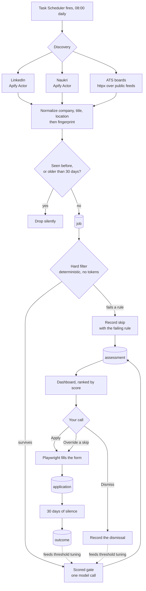
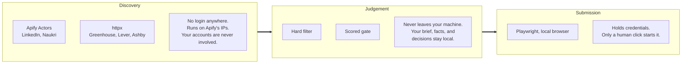
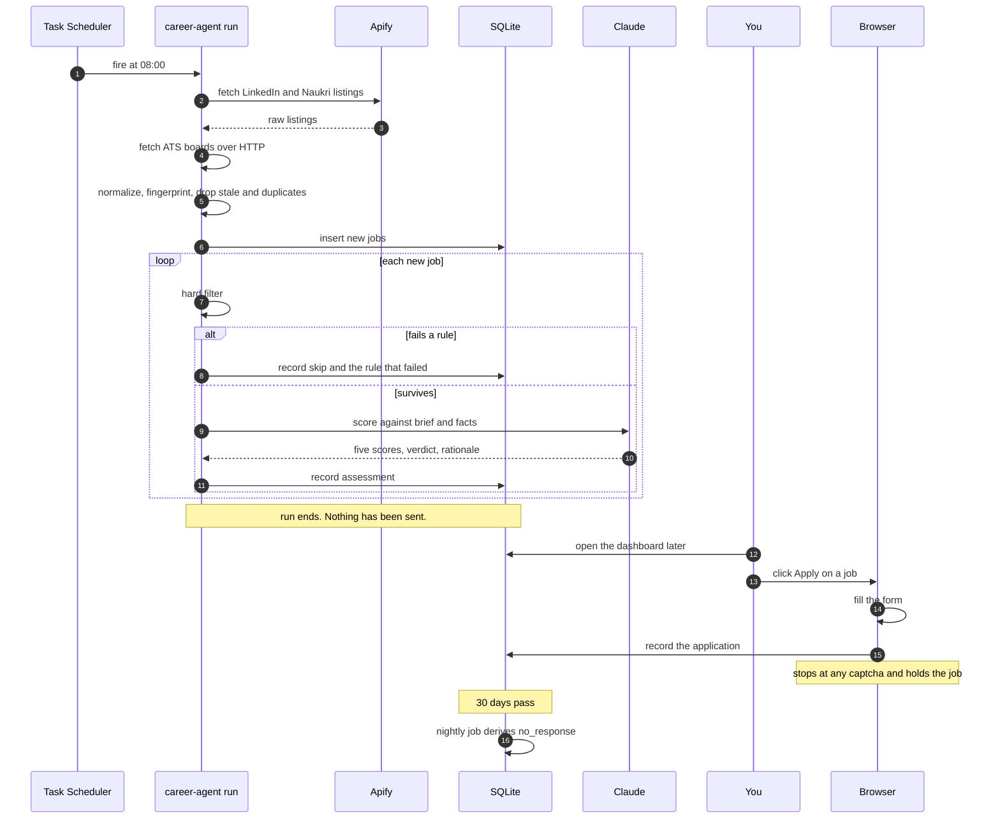
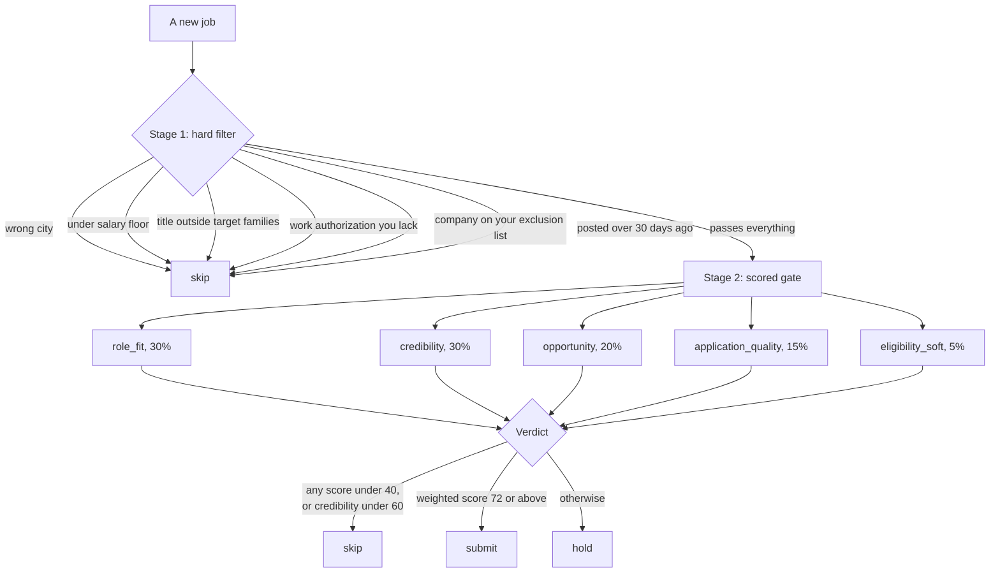
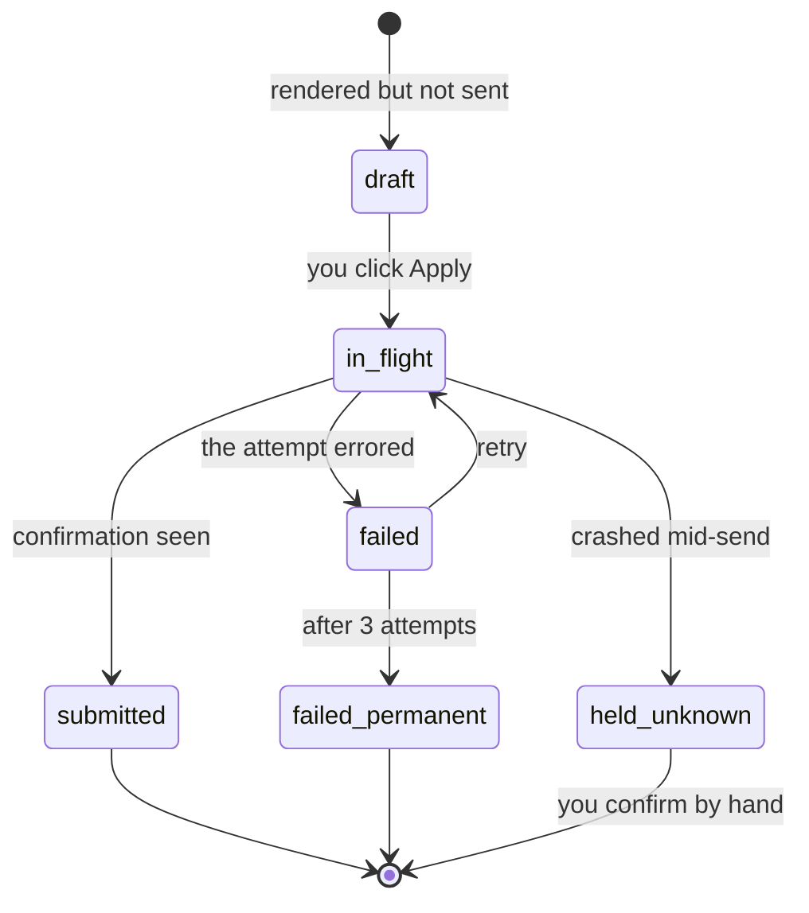
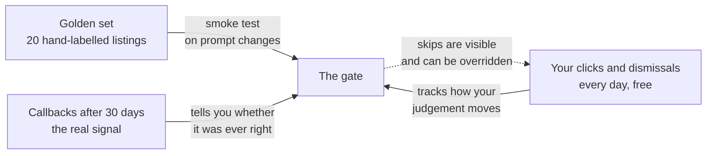
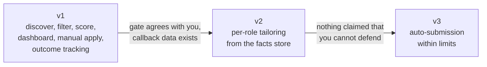

# Career Agent: how it works, end to end

This document explains the shape of the system for someone who has not read the spec.
It covers what happens, in what order, and why the parts are arranged the way they
are. For exact table columns, threshold values, and failure behavior, read
`docs/superpowers/specs/2026-08-18-career-agent-v1-design.md`.

## The short version

Every morning a scheduled task collects new job listings from LinkedIn, Naukri, and a
curated list of company job boards. It throws away anything that fails a set of
mechanical rules, such as being in the wrong city or under your salary floor. What
survives gets read by a language model and scored on five dimensions, with a written
rationale. The results appear in a local dashboard, ranked. You read the rationale and
click Apply on the ones worth pursuing, and a browser fills the form.

Nothing is sent without a click.

Thirty days after each application, if nothing has come back, the system records that
silence as a non-response. Over time that gives you the only number that actually
matters: how often the jobs it recommends turn into conversations.

## End to end

The two dotted lines at the bottom are the point of the whole design. Your clicks and
the eventual outcomes flow back into how the gate is tuned. Without them the system is
a filter that never learns whether it filtered correctly.

## Three lanes, separated by risk

The parts of the system handle very different levels of danger, so they are kept
apart.

Discovery touches no credential, so a scraper breaking costs you nothing but data.
Judgement holds your career brief and your verified experience, which is why it never
leaves the machine. Submission is the only lane that can do something irreversible,
and in v1 it moves only when you click.

## A day in the life

Steps 1 through 12 run unattended. Everything after step 13 needs you.

## What the gate actually does

The gate runs in two stages, and separating them was one of the more consequential
design decisions.

Stage 1 is ordinary code. It costs nothing to run, and a failure there is final. A job
40% under your salary floor cannot be rescued by an attractive tech stack, because
that judgement never reaches the model at all.

Stage 2 costs one model call and only runs on survivors. That ordering keeps the bill
down, but the real reason is correctness: hard requirements and soft preferences
should not be able to trade against each other.

`credibility` carries its own floor of 60, separate from the weighted score. A low
credibility score means the application would have to overstate your experience to be
compelling. That is not something a good tech stack should be able to outvote.

## What happens to an application

An application is not a single event. It has a lifecycle, because the browser can
crash halfway through pressing submit.

Three of these states block any further attempt on the same job: `submitted`,
`failed_permanent`, and `held_unknown`. The last one is the interesting case. If the
process died mid-submission, nobody knows whether the employer received the
application. Blocking is the safe direction, so the job waits for you to check your
confirmation email rather than risk sending twice.

`draft` and `failed` do not block, which is why dry runs are safe to leave lying
around and why a transient error can be retried.

## How it learns

The gate starts out uncalibrated and gets corrected from three directions.

The dotted line matters more than it looks. A dashboard that showed only approved jobs
could never catch the gate being too strict, because you can only disagree with what
you can see. Skipped jobs stay visible behind a filter, and applying to one anyway is
recorded as an override.

That override is the most valuable signal the system produces. It is the gate erring
in the expensive direction, which is the error that would otherwise stay invisible
forever.

Expect this to matter in the first month. Early on, the facts store is thin, so
credibility scores low, so the floor of 60 skips aggressively. A high override rate in
week one means the floor is wrong for a sparse facts store. It does not mean the
market is empty.

## Where things live

| Thing | Where | Why there |
|---|---|---|
| What counts as a good job | `career_brief.toml` | Version controlled, so you can see that you raised the salary floor before response rate dropped |
| Companies whose boards get checked | `ats_boards.toml` | Hand curated, 200 to 400 entries. Probably outlives the automation built on it |
| Verified, defensible experience | `fact` table | The only evidence the gate may credit for credibility |
| Answers to recurring form questions | `qa_bank` table | Notice period, current compensation, work authorization. Volatile ones are never auto-filled |
| Everything else | SQLite, `data/career.db` | Jobs, assessments, applications, outcomes, and the event timeline |
| Your resume | `data/`, gitignored | Along with anything else personal |

## What it deliberately does not do

**It does not submit anything on its own.** Auto-submission arrives in v3, after
tailoring exists and after outcome data shows tailored applications convert. An
application is a consumable resource: you get roughly one attempt per company, and a
generic auto-sent resume does not fail politely, it spends the attempt.

**It does not tailor your resume yet.** That is v2, and it is the reason v3 waits.

**It does not solve captchas.** A captcha means the site has already decided the
session looks suspicious. The system abandons the attempt, saves a screenshot, and
holds the job for you. Pushing through teaches nothing except how to get flagged
harder.

**It does not invent experience.** The gate scores credibility only from the facts
store. If the facts do not support a claim, the correct result is a lower score, not
a better story.

**It does not apply on Naukri.** No usable automation exists for it, so Naukri jobs
are discovered and scored, and you apply through the site yourself.

## The phases

Each arrow is a gate, not a schedule. v2 does not start because v1 shipped; it starts
because the gate's recommendations match your judgement and there is enough callback
data to know whether that judgement was any good.

## Two things to check before building

**Does the subscription token work?** Twenty minutes. If the Agent SDK ignores it,
scoring bills per token and the running cost goes from a few dollars a month to
possibly sixty.

**How many relevant jobs actually exist?** One week of discovery, counting. If your
search yields around 8 genuinely relevant listings a day, the bottleneck was never
clicking, and the effort belongs in tailoring and warm introductions rather than
throughput. If it yields 80, the automation earns its place.

Building a throughput solution before measuring throughput is how the wrong problem
gets solved well.
