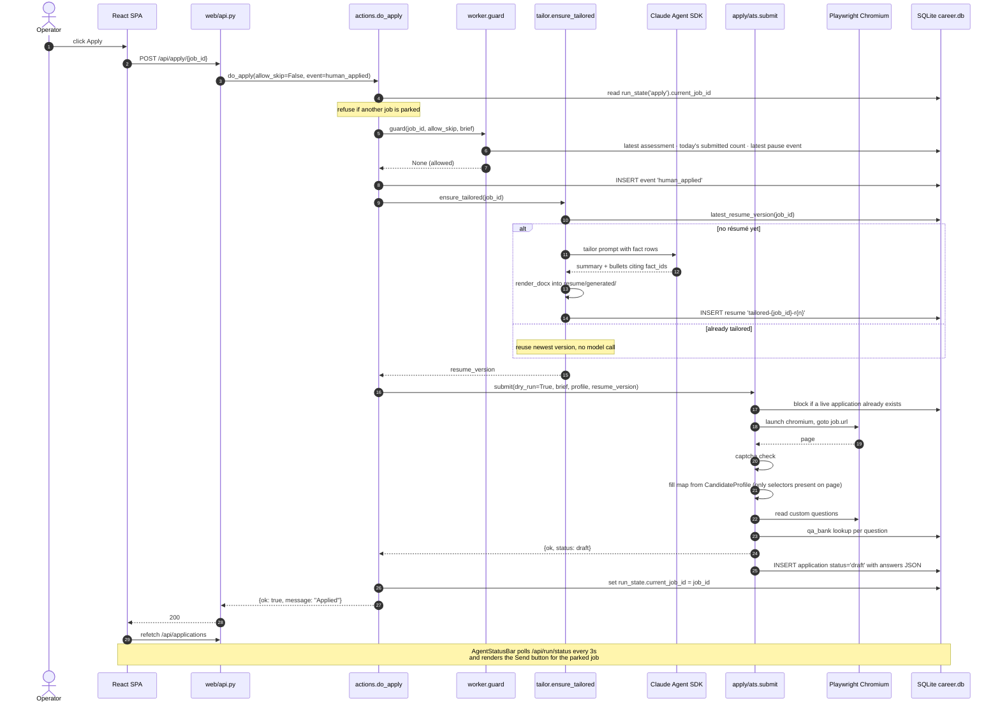
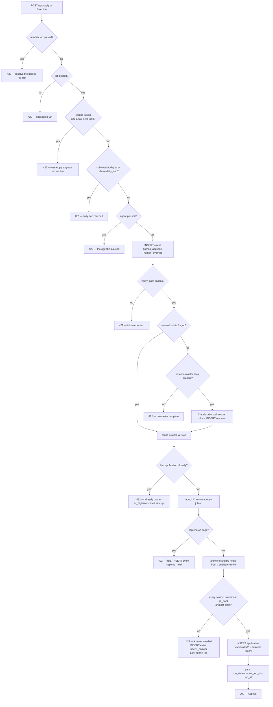
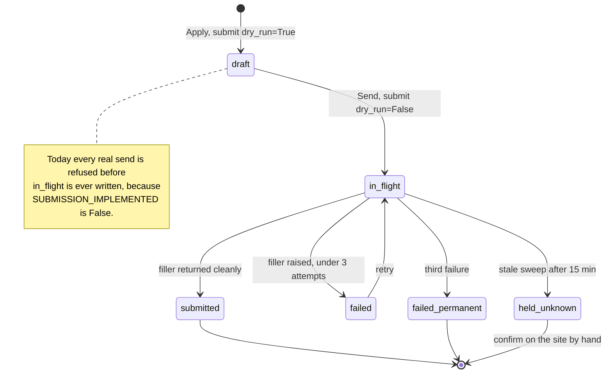
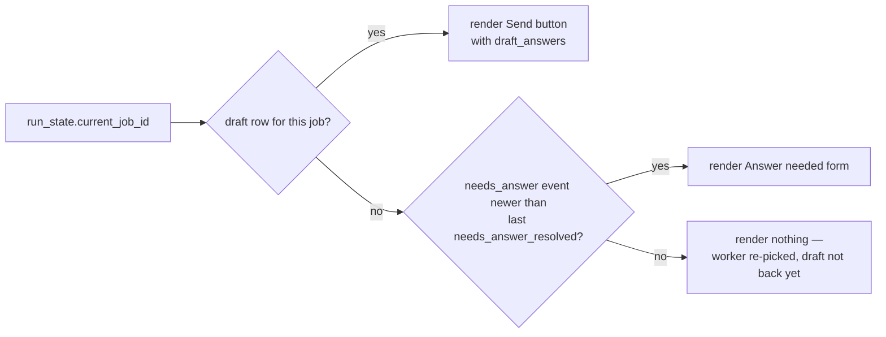

# LLD — The Apply Button

Low-level design of what happens between a click on **Apply** and a row landing in
`application`. Traced against `a7311cf` plus the working tree.

---

## 1. The one-sentence answer

**Apply never sends anything.** It tailors a résumé, opens the job's form in a real
browser, decides every answer, and writes an `application` row with `status='draft'`.
Sending is a second, separate button — and today that button is refused outright by the
`SUBMISSION_IMPLEMENTED = False` kill switch.

Everything below is the machinery around that sentence.

---

## 2. Entry points

Four buttons, two frontends, one function. All of them land in
`actions.do_apply`; they differ only in two arguments.

| Surface | Control | Route | `allow_skip` | `event` |
|---|---|---|---|---|
| React SPA | **Apply** (verdict `submit`/`hold`) | `POST /api/apply/{job_id}` | `False` | `human_applied` |
| React SPA | **Apply** (verdict `skip`) | `POST /api/override/{job_id}` | `True` | `human_override` |
| React SPA | **Track anyway** (Skipped tab) | `POST /api/override/{job_id}` | `True` | `human_override` |
| Jinja + htmx | **Apply** / **Apply anyway** | `POST /apply/{job_id}` · `POST /override/{job_id}` | `False` / `True` | as above |

The SPA picks the route client-side in [Applications.tsx:201](../frontend/src/routes/Applications.tsx#L201):

```tsx
onClick={() => run(job.verdict === 'skip' ? `/api/override/${job.id}` : `/api/apply/${job.id}`)}
```

Both route modules are thin wrappers. `api.py` returns the result dict as JSON;
`app.py` wraps the same dict in a `<span>`. Neither holds logic:

```python
# web/api.py
result = await actions.do_apply(m._conn(), job_id, allow_skip=False,
                                event="human_applied", ...)
return _result(result)                      # 200 if ok else 422

# web/app.py
return _span(await actions.do_apply(conn, job_id, allow_skip=False,
                                    event="human_applied", ...))
```

**Contract.** Every action resolves to `{"ok": bool, "message": str}`. `do_apply` adds
nothing else. Messages are plain text — `app.py`'s `_span` escapes at render time so the
JSON side never receives double-escaped HTML.

---

## 3. Happy path — sequence



---

## 4. Decision flow — every branch



Note that the **park on `needs_answer`** and the **park on success** are the same
write. Both make the status card point at this job; the difference is whether the card
renders an answer form or a Send button.

---

## 5. What gets written

In click order. Every write commits before the next step runs — there is no
enclosing transaction, which is why a crash mid-Apply leaves a partial trail rather than
nothing.

| Step | Table | Row |
|---|---|---|
| 3 | `event` | `type='human_applied'` or `'human_override'` |
| 4 | `resume` | `version='tailored-{job_id}-r{n+1}'`, `path`, `content` JSON (summary, bullets, `prompt_version`) — **only on first Apply** |
| 6 | `event` | `type='captcha_held'` — only on a captcha |
| 6 | `application` | `status='draft'`, `resume_version`, `answers` JSON keyed by CSS selector |
| 7 | `event` | `type='needs_answer'`, `payload=<question label>` — only on the park |
| 7 | `run_state` | `kind='apply'`, `current_job_id=job_id` |

The `answers` JSON is a flat `selector -> value` dict, e.g.
`{"#first_name": "...", "[name='question_123']": "Yes"}`. It carries no field-kind
metadata on purpose: draft time and send time are two separate page loads, so
`_fill_field` re-dispatches on the live element's actual tag and type instead of trusting
anything recorded earlier.

---

## 6. Component call path — draw.io XML

Import into [app.diagrams.net](https://app.diagrams.net) via **Extras → Edit Diagram**,
or save as `.drawio`.

```xml
<mxfile host="app.diagrams.net" version="24.0.0">
  <diagram id="apply-button-lld" name="Apply Button — Call Path">
    <mxGraphModel dx="1200" dy="820" grid="0" gridSize="10" guides="1" tooltips="1"
                  connect="1" arrows="1" fold="1" page="1" pageScale="1"
                  pageWidth="1160" pageHeight="880" math="0" shadow="0">
      <root>
        <mxCell id="0" />
        <mxCell id="1" parent="0" />

        <mxCell id="band_ui" value="Frontend" style="swimlane;horizontal=0;html=1;startSize=26;fillColor=none;strokeColor=#9E9E9E;fontStyle=1" vertex="1" parent="1">
          <mxGeometry x="20" y="20" width="1120" height="110" as="geometry" />
        </mxCell>
        <mxCell id="ui_spa" value="React SPA&#10;Applications.tsx — Apply / Track anyway" style="rounded=1;whiteSpace=wrap;html=1;fillColor=#dae8fc;strokeColor=#6c8ebf" vertex="1" parent="band_ui">
          <mxGeometry x="80" y="30" width="300" height="56" as="geometry" />
        </mxCell>
        <mxCell id="ui_jinja" value="Jinja + htmx&#10;applications.html — Apply / Apply anyway" style="rounded=1;whiteSpace=wrap;html=1;fillColor=#dae8fc;strokeColor=#6c8ebf;dashed=1" vertex="1" parent="band_ui">
          <mxGeometry x="700" y="30" width="300" height="56" as="geometry" />
        </mxCell>

        <mxCell id="band_route" value="Route wrappers (thin)" style="swimlane;horizontal=0;html=1;startSize=26;fillColor=none;strokeColor=#9E9E9E;fontStyle=1" vertex="1" parent="1">
          <mxGeometry x="20" y="150" width="1120" height="100" as="geometry" />
        </mxCell>
        <mxCell id="rt_api" value="web/api.py&#10;POST /api/apply/{job_id}&#10;POST /api/override/{job_id}" style="rounded=1;whiteSpace=wrap;html=1;fillColor=#d5e8d4;strokeColor=#82b366" vertex="1" parent="band_route">
          <mxGeometry x="80" y="24" width="300" height="60" as="geometry" />
        </mxCell>
        <mxCell id="rt_app" value="web/app.py&#10;POST /apply/{job_id}&#10;POST /override/{job_id}" style="rounded=1;whiteSpace=wrap;html=1;fillColor=#d5e8d4;strokeColor=#82b366;dashed=1" vertex="1" parent="band_route">
          <mxGeometry x="700" y="24" width="300" height="60" as="geometry" />
        </mxCell>

        <mxCell id="band_action" value="Shared behaviour" style="swimlane;horizontal=0;html=1;startSize=26;fillColor=none;strokeColor=#9E9E9E;fontStyle=1" vertex="1" parent="1">
          <mxGeometry x="20" y="270" width="1120" height="230" as="geometry" />
        </mxCell>
        <mxCell id="act_do" value="actions.do_apply&#10;allow_skip · event" style="rounded=1;whiteSpace=wrap;html=1;fillColor=#ffe6cc;strokeColor=#d79b00;fontStyle=1" vertex="1" parent="band_action">
          <mxGeometry x="390" y="24" width="300" height="56" as="geometry" />
        </mxCell>
        <mxCell id="act_guard" value="worker.guard&#10;scored · skip · daily cap · paused" style="rounded=1;whiteSpace=wrap;html=1;fillColor=#f8cecc;strokeColor=#b85450" vertex="1" parent="band_action">
          <mxGeometry x="60" y="130" width="240" height="60" as="geometry" />
        </mxCell>
        <mxCell id="act_tailor" value="worker.tailor_for_apply&#10;tailor.ensure_tailored" style="rounded=1;whiteSpace=wrap;html=1;fillColor=#ffe6cc;strokeColor=#d79b00" vertex="1" parent="band_action">
          <mxGeometry x="340" y="130" width="240" height="60" as="geometry" />
        </mxCell>
        <mxCell id="act_submit" value="apply/ats.submit&#10;dry_run=True" style="rounded=1;whiteSpace=wrap;html=1;fillColor=#ffe6cc;strokeColor=#d79b00" vertex="1" parent="band_action">
          <mxGeometry x="620" y="130" width="240" height="60" as="geometry" />
        </mxCell>
        <mxCell id="act_park" value="worker.set_run_state&#10;current_job_id = job_id" style="rounded=1;whiteSpace=wrap;html=1;fillColor=#e1d5e7;strokeColor=#9673a6" vertex="1" parent="band_action">
          <mxGeometry x="890" y="130" width="200" height="60" as="geometry" />
        </mxCell>

        <mxCell id="band_ext" value="External and state" style="swimlane;horizontal=0;html=1;startSize=26;fillColor=none;strokeColor=#9E9E9E;fontStyle=1" vertex="1" parent="1">
          <mxGeometry x="20" y="520" width="1120" height="230" as="geometry" />
        </mxCell>
        <mxCell id="ext_llm" value="Claude Agent SDK&#10;one call, memoized per job" style="rounded=1;whiteSpace=wrap;html=1;fillColor=#f5f5f5;strokeColor=#666666" vertex="1" parent="band_ext">
          <mxGeometry x="340" y="24" width="240" height="56" as="geometry" />
        </mxCell>
        <mxCell id="ext_pw" value="Playwright Chromium&#10;headless=False — a window opens" style="rounded=1;whiteSpace=wrap;html=1;fillColor=#f5f5f5;strokeColor=#666666" vertex="1" parent="band_ext">
          <mxGeometry x="620" y="24" width="240" height="56" as="geometry" />
        </mxCell>
        <mxCell id="ext_qa" value="resolve_answers&#10;qa_bank, 30-day volatile window" style="rounded=1;whiteSpace=wrap;html=1;fillColor=#f8cecc;strokeColor=#b85450" vertex="1" parent="band_ext">
          <mxGeometry x="890" y="24" width="200" height="56" as="geometry" />
        </mxCell>
        <mxCell id="ext_db" value="SQLite career.db (WAL) — event · resume · application · run_state · qa_bank" style="rounded=1;whiteSpace=wrap;html=1;fillColor=#e1d5e7;strokeColor=#9673a6;fontStyle=1" vertex="1" parent="band_ext">
          <mxGeometry x="60" y="140" width="1030" height="56" as="geometry" />
        </mxCell>

        <mxCell id="e1" style="edgeStyle=orthogonalEdgeStyle;html=1;rounded=0" edge="1" parent="1" source="ui_spa" target="rt_api"><mxGeometry relative="1" as="geometry" /></mxCell>
        <mxCell id="e2" style="edgeStyle=orthogonalEdgeStyle;html=1;rounded=0;dashed=1" edge="1" parent="1" source="ui_jinja" target="rt_app"><mxGeometry relative="1" as="geometry" /></mxCell>
        <mxCell id="e3" value="one shared function" style="edgeStyle=orthogonalEdgeStyle;html=1;rounded=0" edge="1" parent="1" source="rt_api" target="act_do"><mxGeometry relative="1" as="geometry" /></mxCell>
        <mxCell id="e4" style="edgeStyle=orthogonalEdgeStyle;html=1;rounded=0;dashed=1" edge="1" parent="1" source="rt_app" target="act_do"><mxGeometry relative="1" as="geometry" /></mxCell>
        <mxCell id="e5" value="1" style="edgeStyle=orthogonalEdgeStyle;html=1;rounded=0" edge="1" parent="1" source="act_do" target="act_guard"><mxGeometry relative="1" as="geometry" /></mxCell>
        <mxCell id="e6" value="2" style="edgeStyle=orthogonalEdgeStyle;html=1;rounded=0" edge="1" parent="1" source="act_do" target="act_tailor"><mxGeometry relative="1" as="geometry" /></mxCell>
        <mxCell id="e7" value="3" style="edgeStyle=orthogonalEdgeStyle;html=1;rounded=0" edge="1" parent="1" source="act_do" target="act_submit"><mxGeometry relative="1" as="geometry" /></mxCell>
        <mxCell id="e8" value="4" style="edgeStyle=orthogonalEdgeStyle;html=1;rounded=0" edge="1" parent="1" source="act_do" target="act_park"><mxGeometry relative="1" as="geometry" /></mxCell>
        <mxCell id="e9" value="first Apply only" style="edgeStyle=orthogonalEdgeStyle;html=1;rounded=0" edge="1" parent="1" source="act_tailor" target="ext_llm"><mxGeometry relative="1" as="geometry" /></mxCell>
        <mxCell id="e10" style="edgeStyle=orthogonalEdgeStyle;html=1;rounded=0" edge="1" parent="1" source="act_submit" target="ext_pw"><mxGeometry relative="1" as="geometry" /></mxCell>
        <mxCell id="e11" value="raises NeedsAnswer" style="edgeStyle=orthogonalEdgeStyle;html=1;rounded=0" edge="1" parent="1" source="act_submit" target="ext_qa"><mxGeometry relative="1" as="geometry" /></mxCell>
        <mxCell id="e12" style="edgeStyle=orthogonalEdgeStyle;html=1;rounded=0" edge="1" parent="1" source="ext_qa" target="ext_db"><mxGeometry relative="1" as="geometry" /></mxCell>
        <mxCell id="e13" style="edgeStyle=orthogonalEdgeStyle;html=1;rounded=0" edge="1" parent="1" source="act_park" target="ext_db"><mxGeometry relative="1" as="geometry" /></mxCell>
        <mxCell id="e14" style="edgeStyle=orthogonalEdgeStyle;html=1;rounded=0" edge="1" parent="1" source="act_guard" target="ext_db"><mxGeometry relative="1" as="geometry" /></mxCell>
      </root>
    </mxGraphModel>
  </diagram>
</mxfile>
```

---

## 7. Application row lifecycle

Apply only ever produces the `draft` node. Everything to its right belongs to **Send**.



`in_flight` is deliberately a **blocking** status. A crash during submission leaves it
behind, its true state is unknown, and `sweep_stale_in_flight` (run on *every* `_conn()`)
promotes it to `held_unknown` after 15 minutes rather than allowing a possible double
send.

---

## 8. The parked-review handshake

Apply parks; the status card unparks. The SPA's `AgentStatusBar` polls
`GET /api/run/status` every **3000 ms** and `run_status_context` decides what to render:



That `id >` comparison closes a real race: without it, answering a question re-parks a
stale "Answer needed" card in the window between the worker re-picking the job and its
draft actually landing.

Resolving the park:

- **Answer** → `POST /api/answer/{job_id}` → `store.qa_upsert` (question normalised to
  lowercase, punctuation stripped, whitespace collapsed; `last_confirmed_at` set on
  *every* call, since confirming an existing answer is itself a reconfirmation) → log
  `needs_answer_resolved` → unpark.
- **Send** → succeeds or fails; a *categorical* refusal (`unsupported`) unparks because a
  retry can never succeed, while a transient failure stays parked so the card keeps
  pointing at the draft worth retrying.

---

## 9. Failure modes

| Condition | Where | HTTP | Message | Parks? |
|---|---|---|---|---|
| Another job parked | `do_apply` | 422 | "Another job is already parked awaiting review" | no |
| Never scored | `guard` | 422 | "This job has not been scored yet." | no |
| Gate said skip, no override | `guard` | 422 | "The gate skipped this one. Use Apply anyway to override." | no |
| Daily cap hit | `guard` | 422 | "Daily cap of N reached." | no |
| Agent paused | `guard` | 422 | "The agent is paused." | no |
| `ANTHROPIC_API_KEY` set | `verify_auth` | 422 | key outranks the subscription token | no |
| No `resume/master.docx` | `ensure_tailored` | 422 | "No master template at …" | no |
| Live application exists | `submit` | 422 | "job N already has a … attempt" | no |
| Captcha on the page | `_check_for_captcha` | 422 | "captcha encountered; held for review" | no |
| Unknown form question | `resolve_answers` | 422 | "Answer needed: …" | **yes** |
| Success | — | 200 | "Applied" | **yes** |

Note the HTTP shape: `api.py`'s `_result` returns **422** for every refusal, including
ordinary policy denials like the daily cap. The SPA's `ApiError` carries the parsed body,
so callers read `body.message` rather than the status.

---

## 10. Concurrency and idempotency

- **The real guarantee** is the partial unique index, not the Python guard:
  ```sql
  CREATE UNIQUE INDEX one_live_application_per_job ON application(job_id)
      WHERE status IN ('in_flight','submitted','held_unknown','failed_permanent');
  ```
  `guard` exists to produce a readable message; the index is what actually prevents a
  double application.

- **Double-clicking Apply** cannot produce two résumés: `resume.version` is `UNIQUE`, and
  `insert_resume` catches the `IntegrityError` and returns whichever row won.

- **Duplicate drafts are possible.** `draft` is not in the `BLOCKING` set, so a second
  `POST /api/apply/{job_id}` on an already-drafted job inserts a *second* draft row.
  Every reader takes `ORDER BY id DESC LIMIT 1`, so behaviour stays correct — and the SPA
  hides the Apply button once `job.has_draft` is true — but the API itself does not
  enforce it. Worth a guard if the API ever gets a second consumer.

- **A drafted job leaves the queue** via `worker.QUEUE_WHERE`'s
  `... ORDER BY ap.id DESC LIMIT 1) IS NOT 'draft'`, so the background worker will not
  re-pick something the operator drafted by hand.

- **WAL mode** is what lets the 3-second status poll read while the apply path writes,
  instead of raising `database is locked`.

---

## 11. Things worth knowing before you touch this

- **A browser window opens on the operator's desktop.** Both fillers launch Chromium with
  `headless=False`. Apply is not a background operation.
- **Apply is synchronous.** The route awaits the whole chain — LLM call plus page load —
  before responding. There is no task queue; a slow posting is a slow HTTP request.
- **The résumé is memoized, not versioned per attempt.** There is no "Retailor" action;
  `ensure_tailored` reuses the newest existing version forever.
- **Send reuses the draft's answers verbatim**, with no re-check of the qa_bank 30-day
  volatility window. This is a deliberate tension, documented in `submit()`: revalidating
  would mean sending something different from what was reviewed. Reuse wins.
- **Two Greenhouse selectors are known stale.** `linkedin_url` and `portfolio_url` map to
  fixed ids that a live Anthropic posting renders as dynamic `#question_<id>` custom
  questions, so those two profile fields are silently never filled — answer them through
  `qa_bank` instead until it is revisited.
- **The Playwright shell has no automated tests by design.** `resolve_answers` is pure and
  fully unit-tested; `_default_compute_answers` and `_default_fill_and_submit` are
  verified by hand against a real posting.

## 12. Where the tests are

| Behaviour | Test |
|---|---|
| `resolve_answers` decisions, volatility window | `tests/test_apply_ats.py` |
| Worker tick, `needs_answer` park | `tests/test_worker.py::test_apply_tick_parks_on_needs_answer_instead_of_looping` |
| Route wrappers, both frontends' data path | `tests/test_web.py` |

Run from `backend/`: `pytest tests/test_apply_ats.py -v`
