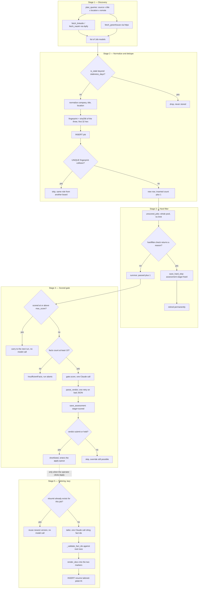
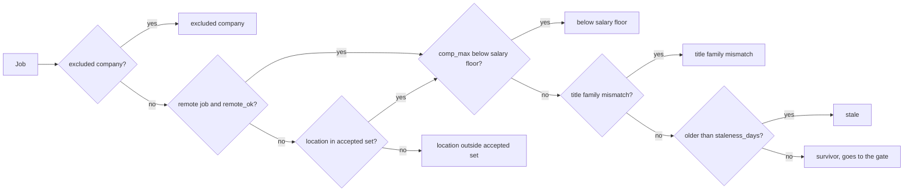
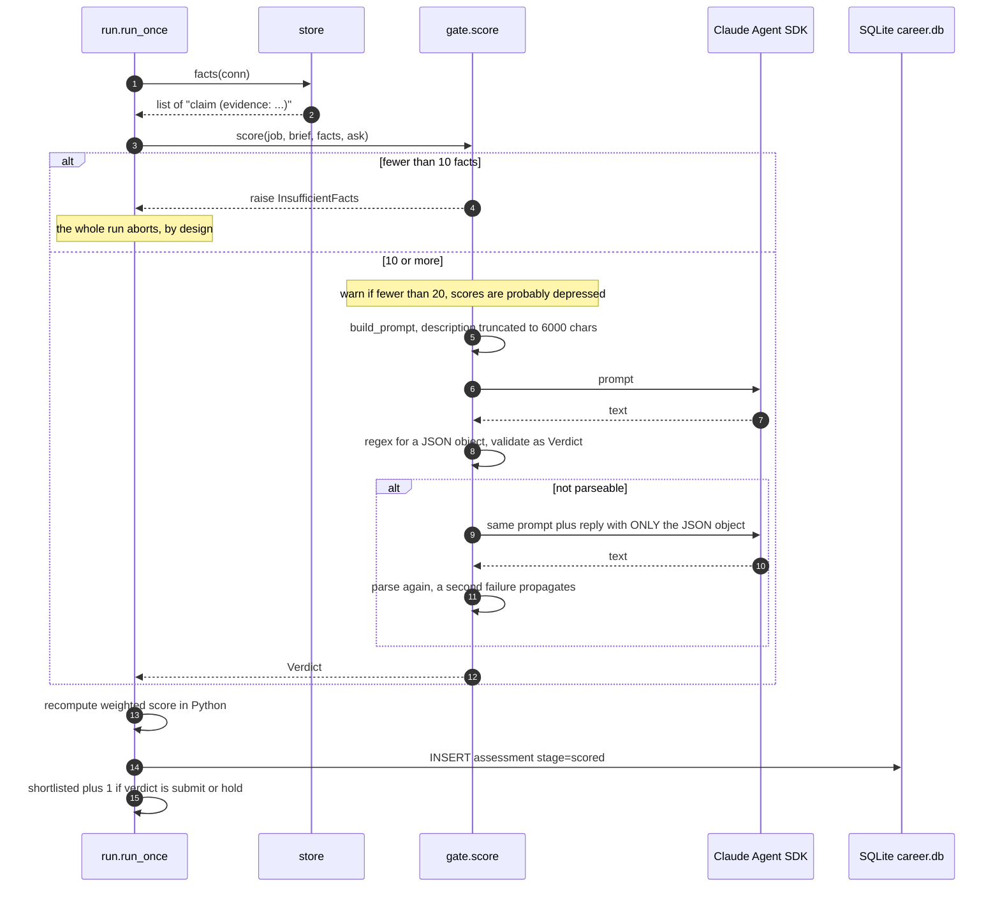
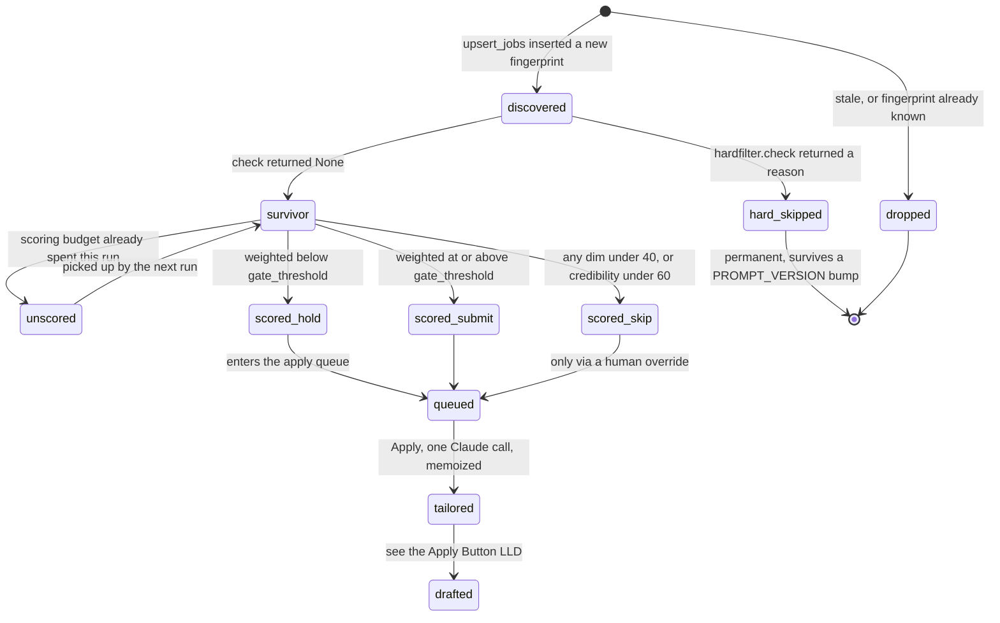

# LLD — Discovery → Hard Filter → Scored Gate → Tailoring

Low-level design of the pipeline that turns job boards into a scored, shortlisted job
with a tailored résumé behind it. Traced against `a7311cf` plus the working tree.

Companion doc: [LLD — The Apply Button](lld-apply-button.md), which picks up where
stage 5 leaves off.

---

## 1. Shape of it

Five stages, but **only the first four run together**. Stages 1–4 are one function,
`run.run_once`. Stage 5 (tailoring) is lazy — it fires per job on Apply, not during a
pipeline run, and never for jobs nobody applies to.

| # | Stage | Module | Cost | Runs when |
|---|---|---|---|---|
| 1 | Discovery | `discovery.py`, `sources/` | Apify credits | every pipeline run |
| 2 | Normalize + dedupe | `normalize.py`, `store.upsert_jobs` | free | every pipeline run |
| 3 | Hard filter | `hardfilter.py` | free | every pipeline run |
| 4 | Scored gate | `gate.py` | **one Claude call per job** | budgeted per run |
| 5 | Tailoring | `tailor.py` | **one Claude call per job** | on Apply, memoized |

The ordering is the whole design: everything free happens before anything paid, and the
free parts are *persisted* so they never re-run against the same job.

---

## 2. Trigger and execution model

Two entry points, one body.

```python
# CLI — what the scheduled task calls
career-agent run [--db --brief --boards --max-score]
  -> asyncio.run(run_once(args))

# Dashboard — POST /pipeline/run-now
  -> refuse if run_state('pipeline').status not in ('idle','error')
  -> set status='running', zero the counters, stamp started_at
  -> log event 'pipeline_started'
  -> asyncio.create_task(pipeline.run_background(...))
```

The scheduled task is registered by `scripts/install-scheduler.ps1` as
`CareerAgentDaily` with `New-ScheduledTaskTrigger -Daily -At $Time`.

**The thread hop matters.** `run_background` does not simply await `run_once`:

```python
await asyncio.to_thread(asyncio.run, run_module.run_once(args, progress=...))
```

`run_once` is `async def`, but its discovery phase is pure blocking I/O with no await
point — the Apify SDK's synchronous `.call()`, 12–24 times a run, plus sync `httpx` for
ATS boards. Awaiting it on the serving loop would pin every route for minutes, including
the status poller watching the run. `asyncio.run` inside `asyncio.to_thread` gives it a
fresh loop on a worker thread, and keeps `run_once`'s own SQLite connection created *and*
used on that one thread, as `check_same_thread` requires.

Progress flows back through an injected callback, not a direct write — `run.py` is the
CLI module and must not import the web layer:

```python
progress(stage="score", passed=..., scored=..., shortlisted=..., message="...")
```

`pipeline._progress_writer` opens its connection **lazily on first call**, because it runs
on the worker thread. Fields in `PROGRESS_FIELDS` go to `run_state`; a `message` becomes
an `event` row of type `pipeline_progress`.

---

## 3. End-to-end flow



---

## 4. Stage 1 — Discovery

### Query planning

`plan_queries` is a triple nested loop with a conditional fourth pass:

```python
for source in ("linkedin", "naukri"):
    for title in brief.target_titles:
        for location in brief.search_locations:
            queries.append(Query(source, title, location, remote=False))
            if brief.remote_ok:
                queries.append(Query(source, title, location, remote=True))
```

**Remote is not a city.** It is a separate parameter on both Actors, so `remote_ok` adds a
second pass per title rather than sending the string `"Remote"` as a location.

**Fan-out with the live brief** (3 titles, 1 search location, `remote_ok = true`):

```
2 sources × 3 titles × 1 location × 2 (remote pass) = 12 Actor runs
12 × MAX_JOBS_PER_QUERY (50)                        = up to 600 listings
+ 2 Greenhouse boards                                = 2 HTTP GETs
```

Adding one city takes it to 24 Actor runs; adding one title takes it to 16. This is the
main cost lever in the whole system, and it is why location comes from the brief and not
from a command-line flag — filtering after the fact is not the same as searching.

### The three lanes

| Lane | Transport | Actor / endpoint | Risk |
|---|---|---|---|
| LinkedIn | Apify | `valig/linkedin-jobs-scraper` | third-party account |
| Naukri | Apify | `automation-lab/naukri-scraper` | third-party account |
| ATS | `httpx` | `boards-api.greenhouse.io/v1/boards/{token}/jobs?content=true` | none — public, no auth |

Actor ids are module constants: *changing an Actor is a code change, not a runtime
decision.*

Source-specific input mapping:

```python
# LinkedIn — f_WT workplace code: 1 on-site, 2 remote, 3 hybrid
{"title": kw, "location": loc, "limit": 50}          + {"remote": ["2"]}
# Naukri
{"keyword": kw, "location": loc, "maxJobs": 50, "sortBy": "date"} + {"workMode": "remote"}
```

### Failure isolation

Every lane fails soft, and this is deliberate — one flaky Actor must not cost the whole
run:

```python
except Exception as exc:      # an Actor outage must not kill the run
    log.warning("apify actor %s failed: %s", actor_id, exc)
    return []
```

Same for Greenhouse: `httpx.HTTPError` → warn → `[]`. A run where every lane fails
returns zero jobs and reports success. **There is no alert on an empty run** — worth
knowing when a morning shows nothing new.

One SDK detail encoded on purpose: `apify-client >= 3` returns a typed `Run` object, so
the code reads `run.default_dataset_id` rather than subscripting. Subscripting raises
`TypeError`, which the broad `except` would have reported as an Actor failure even though
the Actor succeeded.

Items missing their id key (`id` for LinkedIn, `jobId` for Naukri) are dropped in the
comprehension.

---

## 5. Stage 2 — Normalization and dedupe

Three normalizers, each solving a specific way the same role differs across boards:

| Function | Transform | Example |
|---|---|---|
| `company` | drop suffix words, join the rest | `"Acme Technologies Pvt Ltd"` → `"acme"` |
| `title` | strip parentheticals, expand abbreviations, drop noise, **sort unique tokens** | `"Sr. ML Engineer (Remote)"` → `"enginerml..."` sorted |
| `location` | split on comma, drop country suffixes, alias, strip non-alphanumeric | `"Bengaluru, India"` → `"bangalore"` |

Sorting the title tokens is what makes word order irrelevant — `"Engineer, Machine
Learning"` and `"Machine Learning Engineer"` collapse to the same string. `TITLE_NOISE`
drops `software` and `staff`, which sources add inconsistently.

```python
fingerprint = sha256(f"{company}|{title}|{location}").hexdigest()[:32]
```

**`posted_at` is deliberately excluded** — the same role carries different dates on
different boards, so including it would defeat cross-source dedupe entirely.

`upsert_jobs` then does staleness-first, insert-second:

```python
if normalize.is_stale(job, brief.staleness_days):
    continue                              # never stored at all
try:
    conn.execute("INSERT INTO job (fingerprint, ...) VALUES (...)")
    inserted += 1
except sqlite3.IntegrityError:
    continue                              # same role, already seen from another board
```

**A reporting nuance:** `run.py` computes `duplicates = len(jobs) - new_count`, so the
dashboard's "duplicates" counter actually conflates true fingerprint collisions with
stale drops. Both are "listings that did not become rows", but the label is narrower than
the number.

`is_stale` fails open: no `posted_at`, or an unparseable one, means *not* stale.

---

## 6. Stage 3 — Hard filter

Deterministic, free, no model call. First matching rule wins and returns its reason
string; surviving means `None`.



Details that matter:

- **The remote short-circuit.** Location is checked only when the job is *not* an accepted
  remote job — `if not (job.is_remote and brief.remote_ok)`. A remote role skips the
  location gate entirely.
- **Two location lists, on purpose.** `search_locations` drives what we *ask* each source
  for; `locations` is what the filter *accepts* on the way back, usually a superset. The
  live brief asks for `["Chennai"]` but accepts `["Chennai", "hybrid"]`.
- **Substring matching in both directions** for locations and title families:
  `any(a in loc or loc in a for a in accepted)`. Generous by design — a false negative
  here is invisible and permanent.
- **The salary rule needs `comp_max`.** LinkedIn and Greenhouse rarely provide it, so in
  practice this rule fires mostly on Naukri rows. Unknown compensation always survives.

### Why the sweep does not stop at the budget

```python
for row in store.unscored_jobs(conn, gate.PROMPT_VERSION):
    reason = hardfilter.check(job, brief)
    if reason:
        store.save_hard_skip(conn, row["id"], reason);  skipped += 1;  continue
    passed += 1
    if scored >= max_score:
        progress(passed=passed);  continue      # budget spent, this one carries over
    verdict = await gate.score(...)
```

The hard-filter half sweeps the **whole pool** even after the scoring budget is spent.
Breaking out early would leave the pool dirty and reproduce the same problem next run;
one full pass retires everything that can never pass, so the following run finds real
candidates immediately.

### Permanence

`save_hard_skip` writes `assessment(stage='hard', verdict='skip', model='hardfilter',
prompt_version='n/a')`, and `unscored_jobs` excludes anything with a `stage='hard'` row:

```sql
AND NOT EXISTS (SELECT 1 FROM assessment a WHERE a.job_id = j.id
                  AND (a.stage = 'hard' OR a.prompt_version = ?))
```

**Consequence worth internalising:** bumping `PROMPT_VERSION` brings previously *scored*
jobs back for re-scoring, but **not** hard-filtered ones. Widening the brief does not
resurrect anything the old brief rejected. Re-examining those needs a manual
`DELETE FROM assessment WHERE stage='hard'`.

---

## 7. Stage 4 — Scored gate



### The scoring contract

Five dimensions, `0..100`, validated by pydantic `Field(ge=0, le=100)`:

| Dimension | Weight | What it asks |
|---|---|---|
| `role_fit` | 0.30 | match to target titles, stack, domain, direction |
| `credibility` | 0.30 | whether the **verified facts** support a strong application without exaggeration |
| `opportunity` | 0.20 | company reputation, role clarity, growth, freshness, warning signs |
| `application_quality` | 0.15 | whether a complete, non-conflicting application can be built |
| `eligibility_soft` | 0.05 | residual eligibility the mechanical filter could not decide |

Verdict rules, applied in order by the prompt:

1. any dimension below 40, **or** `credibility` below 60 → `skip`
2. weighted score at or above `brief.gate_threshold` (72 in the live brief) → `submit`
3. otherwise → `hold`

### The trust asymmetry

The model returns both the dimensions *and* a `verdict` string. The **verdict is
trusted**; the **weighted score is not** — `Verdict.weighted` recomputes it locally from
`WEIGHTS` in `models.py`, and that recomputed value is what lands in
`assessment.weighted_score` and what orders the apply queue. A model that does the
arithmetic wrong still gets the ordering right.

### Facts are the hard floor

`MIN_FACTS_HARD = 10` raises `InsufficientFacts` and aborts. The reasoning is in the
error text: credibility carries 30% weight with a floor of 60, so scoring against a thin
facts store would skip everything *for a reason that looks like the market*. Between 10
and `MIN_FACTS_WARN = 20` it logs a warning and proceeds.

### Budget

`max_score` comes from `setting.max_score_per_run` (default 25), overridable for a single
run by `--max-score` — **not persisted**. `max_score == 0` logs a warning and disables
scoring entirely; discovery and the hard filter still run. If the stored `scoring_model`
is no longer in `SCORING_MODELS`, `run_once` falls back to the default and says so rather
than failing every call or stranding the user.

---

## 8. Stage 5 — Tailoring

Not part of a pipeline run. `ensure_tailored` is called from
`worker.tailor_for_apply`, which is called from `actions.do_apply` and `worker.apply_tick`.

```python
existing = store.latest_resume_version(conn, job_id)
if existing:
    return existing            # memoized — there is no "Retailor" action
if not TEMPLATE_PATH.exists():
    raise ValueError(f"No master template at {TEMPLATE_PATH}.")
result  = await tailor(job, brief, store.fact_rows(conn), ask)
version = store.next_resume_version(conn, job_id)      # tailored-{job_id}-r{n+1}
render_docx(TEMPLATE_PATH, result, OUTPUT_DIR / f"{version}.docx")
return store.insert_resume(conn, job_id, version, str(out_path), content)
```

`TEMPLATE_PATH` (`resume/master.docx`) and `OUTPUT_DIR` (`resume/generated`) are
**module attributes, not function defaults**, and both are CWD-relative — so
`career-agent` must run from `backend/`, and tests can monkeypatch them without a module
reload.

### The anti-fabrication chain

Tailoring uses `fact_rows` — `(id, text)` pairs — rather than `facts`' plain strings,
specifically so citations can be checked:

1. The prompt numbers each fact and demands every bullet cite the ids it draws from.
2. `TailorResult` requires `bullets: min_length=1` and each `Bullet.fact_ids:
   min_length=1`. A bullet citing nothing fails validation.
3. `_validate_fact_ids` checks every cited id against the real row ids and raises on any
   unknown one.
4. Any `ValueError` from steps 1–3 triggers **one** retry with an appended correction,
   then validates again. A second failure propagates.

The same `MIN_FACTS_HARD = 10` floor applies — imported from `gate.py`, so the two stages
cannot drift apart on what "enough evidence" means.

### Rendering is deterministic, not generative

`render_docx` never asks the model where anything goes:

```python
summary_para = _find_marker(doc, "<<SUMMARY>>")      # exact text match
_set_text(summary_para, result.summary)              # keeps run[0]'s formatting

bullet_marker = _find_marker(doc, "<<PROJECT_BULLET>>")
for bullet in result.bullets:
    clone = copy.deepcopy(bullet_marker._p)          # clone the XML element
    bullet_marker._p.addprevious(clone)
    _set_text(Paragraph(clone, bullet_marker._parent), bullet.text)
bullet_marker._p.getparent().remove(bullet_marker._p)   # drop the marker itself
```

Cloning the marker paragraph is what preserves bullet styling — list level, numbering,
font — for every generated bullet. Header, contact block, education and layout are never
touched. A missing marker raises rather than guessing at a paragraph.

`content` stored alongside the file is the JSON audit trail:
`{summary, bullets: [{text, fact_ids}], prompt_version: "tailor-v1"}`.

### Two prompt versions, only one of them live

| Constant | Value | Effect |
|---|---|---|
| `gate.PROMPT_VERSION` | `gate-v1` | **invalidates** stored assessments, forces a re-score |
| `tailor.TAILOR_PROMPT_VERSION` | `tailor-v1` | **recorded only** — nothing reads it back |

Because `ensure_tailored` returns any existing version unconditionally, bumping the
tailor version changes nothing for jobs that already have a résumé. Re-tailoring means
deleting the `resume` row.

---

## 9. A job row's life



---

## 10. Pipeline data flow — draw.io XML

Import into [app.diagrams.net](https://app.diagrams.net) via **Extras → Edit Diagram**.

```xml
<mxfile host="app.diagrams.net" version="24.0.0">
  <diagram id="pipeline-lld" name="Discovery to Tailoring">
    <mxGraphModel dx="1300" dy="820" grid="0" gridSize="10" guides="1" tooltips="1"
                  connect="1" arrows="1" fold="1" page="1" pageScale="1"
                  pageWidth="1240" pageHeight="720" math="0" shadow="0">
      <root>
        <mxCell id="0" />
        <mxCell id="1" parent="0" />

        <mxCell id="l1" value="1 — Discovery (paid: Apify)" style="swimlane;html=1;startSize=32;fillColor=none;strokeColor=#6c8ebf;fontStyle=1;horizontal=1" vertex="1" parent="1">
          <mxGeometry x="20" y="20" width="230" height="330" as="geometry" />
        </mxCell>
        <mxCell id="n11" value="plan_queries&#10;source x title x location x remote" style="rounded=1;whiteSpace=wrap;html=1;fillColor=#dae8fc;strokeColor=#6c8ebf" vertex="1" parent="l1">
          <mxGeometry x="15" y="46" width="200" height="52" as="geometry" />
        </mxCell>
        <mxCell id="n12" value="fetch_linkedin / fetch_naukri&#10;Apify, 50 per query" style="rounded=1;whiteSpace=wrap;html=1;fillColor=#dae8fc;strokeColor=#6c8ebf" vertex="1" parent="l1">
          <mxGeometry x="15" y="118" width="200" height="52" as="geometry" />
        </mxCell>
        <mxCell id="n13" value="fetch_greenhouse&#10;public board feed, httpx" style="rounded=1;whiteSpace=wrap;html=1;fillColor=#dae8fc;strokeColor=#6c8ebf" vertex="1" parent="l1">
          <mxGeometry x="15" y="190" width="200" height="52" as="geometry" />
        </mxCell>
        <mxCell id="n14" value="any lane failure returns []&#10;the run continues" style="rounded=1;whiteSpace=wrap;html=1;fillColor=#fff2cc;strokeColor=#d6b656;dashed=1" vertex="1" parent="l1">
          <mxGeometry x="15" y="262" width="200" height="48" as="geometry" />
        </mxCell>

        <mxCell id="l2" value="2 — Normalize and dedupe (free)" style="swimlane;html=1;startSize=32;fillColor=none;strokeColor=#82b366;fontStyle=1;horizontal=1" vertex="1" parent="1">
          <mxGeometry x="270" y="20" width="230" height="330" as="geometry" />
        </mxCell>
        <mxCell id="n21" value="is_stale&#10;dropped before any write" style="rounded=1;whiteSpace=wrap;html=1;fillColor=#d5e8d4;strokeColor=#82b366" vertex="1" parent="l2">
          <mxGeometry x="15" y="46" width="200" height="52" as="geometry" />
        </mxCell>
        <mxCell id="n22" value="normalize company, title, location&#10;title tokens sorted" style="rounded=1;whiteSpace=wrap;html=1;fillColor=#d5e8d4;strokeColor=#82b366" vertex="1" parent="l2">
          <mxGeometry x="15" y="118" width="200" height="52" as="geometry" />
        </mxCell>
        <mxCell id="n23" value="fingerprint&#10;sha256 of the three, 32 hex" style="rounded=1;whiteSpace=wrap;html=1;fillColor=#d5e8d4;strokeColor=#82b366" vertex="1" parent="l2">
          <mxGeometry x="15" y="190" width="200" height="52" as="geometry" />
        </mxCell>
        <mxCell id="n24" value="INSERT job&#10;IntegrityError means duplicate" style="rounded=1;whiteSpace=wrap;html=1;fillColor=#d5e8d4;strokeColor=#82b366" vertex="1" parent="l2">
          <mxGeometry x="15" y="262" width="200" height="48" as="geometry" />
        </mxCell>

        <mxCell id="l3" value="3 — Hard filter (free)" style="swimlane;html=1;startSize=32;fillColor=none;strokeColor=#b85450;fontStyle=1;horizontal=1" vertex="1" parent="1">
          <mxGeometry x="520" y="20" width="230" height="330" as="geometry" />
        </mxCell>
        <mxCell id="n31" value="unscored_jobs&#10;whole pool, no limit" style="rounded=1;whiteSpace=wrap;html=1;fillColor=#f8cecc;strokeColor=#b85450" vertex="1" parent="l3">
          <mxGeometry x="15" y="46" width="200" height="52" as="geometry" />
        </mxCell>
        <mxCell id="n32" value="hardfilter.check&#10;company, location, salary, title, age" style="rounded=1;whiteSpace=wrap;html=1;fillColor=#f8cecc;strokeColor=#b85450" vertex="1" parent="l3">
          <mxGeometry x="15" y="118" width="200" height="52" as="geometry" />
        </mxCell>
        <mxCell id="n33" value="save_hard_skip&#10;assessment stage=hard" style="rounded=1;whiteSpace=wrap;html=1;fillColor=#f8cecc;strokeColor=#b85450" vertex="1" parent="l3">
          <mxGeometry x="15" y="190" width="200" height="52" as="geometry" />
        </mxCell>
        <mxCell id="n34" value="permanent&#10;a PROMPT_VERSION bump will not undo it" style="rounded=1;whiteSpace=wrap;html=1;fillColor=#fff2cc;strokeColor=#d6b656;dashed=1" vertex="1" parent="l3">
          <mxGeometry x="15" y="262" width="200" height="48" as="geometry" />
        </mxCell>

        <mxCell id="l4" value="4 — Scored gate (paid: Claude)" style="swimlane;html=1;startSize=32;fillColor=none;strokeColor=#9673a6;fontStyle=1;horizontal=1" vertex="1" parent="1">
          <mxGeometry x="770" y="20" width="230" height="330" as="geometry" />
        </mxCell>
        <mxCell id="n41" value="facts floor&#10;10 minimum or the run aborts" style="rounded=1;whiteSpace=wrap;html=1;fillColor=#e1d5e7;strokeColor=#9673a6" vertex="1" parent="l4">
          <mxGeometry x="15" y="46" width="200" height="52" as="geometry" />
        </mxCell>
        <mxCell id="n42" value="gate.score&#10;5 weighted dimensions" style="rounded=1;whiteSpace=wrap;html=1;fillColor=#e1d5e7;strokeColor=#9673a6" vertex="1" parent="l4">
          <mxGeometry x="15" y="118" width="200" height="52" as="geometry" />
        </mxCell>
        <mxCell id="n43" value="parse_verdict&#10;one retry, then propagate" style="rounded=1;whiteSpace=wrap;html=1;fillColor=#e1d5e7;strokeColor=#9673a6" vertex="1" parent="l4">
          <mxGeometry x="15" y="190" width="200" height="52" as="geometry" />
        </mxCell>
        <mxCell id="n44" value="save_assessment&#10;weighted recomputed in Python" style="rounded=1;whiteSpace=wrap;html=1;fillColor=#e1d5e7;strokeColor=#9673a6" vertex="1" parent="l4">
          <mxGeometry x="15" y="262" width="200" height="48" as="geometry" />
        </mxCell>

        <mxCell id="l5" value="5 — Tailoring (lazy, on Apply)" style="swimlane;html=1;startSize=32;fillColor=none;strokeColor=#d79b00;fontStyle=1;horizontal=1;dashed=1" vertex="1" parent="1">
          <mxGeometry x="1020" y="20" width="200" height="330" as="geometry" />
        </mxCell>
        <mxCell id="n51" value="ensure_tailored&#10;reuse if one exists" style="rounded=1;whiteSpace=wrap;html=1;fillColor=#ffe6cc;strokeColor=#d79b00" vertex="1" parent="l5">
          <mxGeometry x="12" y="46" width="176" height="52" as="geometry" />
        </mxCell>
        <mxCell id="n52" value="tailor&#10;bullets must cite fact ids" style="rounded=1;whiteSpace=wrap;html=1;fillColor=#ffe6cc;strokeColor=#d79b00" vertex="1" parent="l5">
          <mxGeometry x="12" y="118" width="176" height="52" as="geometry" />
        </mxCell>
        <mxCell id="n53" value="_validate_fact_ids&#10;unknown id means retry" style="rounded=1;whiteSpace=wrap;html=1;fillColor=#ffe6cc;strokeColor=#d79b00" vertex="1" parent="l5">
          <mxGeometry x="12" y="190" width="176" height="52" as="geometry" />
        </mxCell>
        <mxCell id="n54" value="render_docx&#10;two markers, nothing else" style="rounded=1;whiteSpace=wrap;html=1;fillColor=#ffe6cc;strokeColor=#d79b00" vertex="1" parent="l5">
          <mxGeometry x="12" y="262" width="176" height="48" as="geometry" />
        </mxCell>

        <mxCell id="dbrow" value="SQLite career.db (WAL) — job · assessment · resume · run_state · event · fact" style="rounded=1;whiteSpace=wrap;html=1;fillColor=#e1d5e7;strokeColor=#9673a6;fontStyle=1" vertex="1" parent="1">
          <mxGeometry x="20" y="400" width="1200" height="50" as="geometry" />
        </mxCell>
        <mxCell id="ext1" value="Apify Actors&#10;LinkedIn · Naukri" style="rounded=1;whiteSpace=wrap;html=1;fillColor=#f5f5f5;strokeColor=#666666" vertex="1" parent="1">
          <mxGeometry x="20" y="500" width="220" height="48" as="geometry" />
        </mxCell>
        <mxCell id="ext2" value="Greenhouse Boards API&#10;public, no auth" style="rounded=1;whiteSpace=wrap;html=1;fillColor=#f5f5f5;strokeColor=#666666" vertex="1" parent="1">
          <mxGeometry x="270" y="500" width="220" height="48" as="geometry" />
        </mxCell>
        <mxCell id="ext3" value="Claude Agent SDK&#10;scoring and tailoring" style="rounded=1;whiteSpace=wrap;html=1;fillColor=#f5f5f5;strokeColor=#666666" vertex="1" parent="1">
          <mxGeometry x="770" y="500" width="220" height="48" as="geometry" />
        </mxCell>
        <mxCell id="ext4" value="resume/master.docx&#10;plus resume/generated/" style="rounded=1;whiteSpace=wrap;html=1;fillColor=#f5f5f5;strokeColor=#666666" vertex="1" parent="1">
          <mxGeometry x="1020" y="500" width="200" height="48" as="geometry" />
        </mxCell>

        <mxCell id="p1" style="edgeStyle=orthogonalEdgeStyle;html=1;rounded=0;strokeWidth=2" edge="1" parent="1" source="l1" target="l2"><mxGeometry relative="1" as="geometry" /></mxCell>
        <mxCell id="p2" style="edgeStyle=orthogonalEdgeStyle;html=1;rounded=0;strokeWidth=2" edge="1" parent="1" source="l2" target="l3"><mxGeometry relative="1" as="geometry" /></mxCell>
        <mxCell id="p3" style="edgeStyle=orthogonalEdgeStyle;html=1;rounded=0;strokeWidth=2" edge="1" parent="1" source="l3" target="l4"><mxGeometry relative="1" as="geometry" /></mxCell>
        <mxCell id="p4" value="only on Apply" style="edgeStyle=orthogonalEdgeStyle;html=1;rounded=0;dashed=1;strokeWidth=2" edge="1" parent="1" source="l4" target="l5"><mxGeometry relative="1" as="geometry" /></mxCell>
        <mxCell id="p5" style="edgeStyle=orthogonalEdgeStyle;html=1;rounded=0" edge="1" parent="1" source="ext1" target="n12"><mxGeometry relative="1" as="geometry" /></mxCell>
        <mxCell id="p6" style="edgeStyle=orthogonalEdgeStyle;html=1;rounded=0" edge="1" parent="1" source="ext2" target="n13"><mxGeometry relative="1" as="geometry" /></mxCell>
        <mxCell id="p7" style="edgeStyle=orthogonalEdgeStyle;html=1;rounded=0" edge="1" parent="1" source="ext3" target="n42"><mxGeometry relative="1" as="geometry" /></mxCell>
        <mxCell id="p8" style="edgeStyle=orthogonalEdgeStyle;html=1;rounded=0" edge="1" parent="1" source="ext4" target="n54"><mxGeometry relative="1" as="geometry" /></mxCell>
        <mxCell id="p9" style="edgeStyle=orthogonalEdgeStyle;html=1;rounded=0;dashed=1" edge="1" parent="1" source="dbrow" target="l3"><mxGeometry relative="1" as="geometry" /></mxCell>
      </root>
    </mxGraphModel>
  </diagram>
</mxfile>
```

---

## 11. Cost model per run

| Stage | Unit cost | Multiplier (live brief) | Bounded by |
|---|---|---|---|
| Discovery | 1 Actor run | 12 | `target_titles × search_locations × 2 sources × remote pass` |
| Discovery | 1 HTTP GET | 2 | rows in `ats_boards.toml` |
| Normalize + dedupe | 0 | — | — |
| Hard filter | 0 | whole unscored pool | — |
| Scored gate | 1 Claude call | ≤ 25 | `setting.max_score_per_run` |
| Tailoring | 1 Claude call | ≤ 1 per job, ever | memoized on `resume` rows |

Worst case for a run: 12 Actor runs, 2 HTTP GETs, 25 Claude calls. The pool of listings
touched can be far larger than 25 — the hard filter absorbs the difference for free.

---

## 12. Failure modes

| Condition | Where | Effect |
|---|---|---|
| `ANTHROPIC_API_KEY` set | `verify_auth` | run aborts before any I/O — would silently bill per token |
| `CLAUDE_CODE_OAUTH_TOKEN` missing | `verify_auth` | run aborts with setup instructions |
| Apify Actor down / rate-limited | `sources.apify._run` | warn, that lane returns `[]`, run continues |
| Greenhouse board 404 or timeout | `sources.ats.fetch_greenhouse` | warn, `[]`, run continues |
| Every lane fails | — | **run reports success with zero jobs, silently** |
| Retired `scoring_model` stored | `run_once` | warn, fall back to `DEFAULT_SCORING_MODEL` |
| Fewer than 10 facts | `gate.score` | `InsufficientFacts` propagates, whole run fails |
| Model returns non-JSON twice | `gate.parse_verdict` | `ValueError` propagates, whole run fails |
| `max_score_per_run == 0` | `run_once` | warn, scoring disabled, stages 1–3 still run |
| Any exception in a background run | `pipeline.run_background` | `run_state.status='error'`, `last_error` set, `pipeline_error` event |
| Server restart mid-run | `app.lifespan` | a stranded `running` row is flipped to `error` on next boot |
| No `resume/master.docx` | `ensure_tailored` | `ValueError`, Apply refuses |
| Bullet cites an unknown fact id | `_validate_fact_ids` | one retry, then propagate |

Note that a gate failure is **fatal to the run**, not to the job. One unparseable model
reply loses the remainder of that run's scoring budget.

---

## 13. Re-run semantics

Running the pipeline twice in a row is safe and mostly cheap:

- **Discovery re-runs in full** — Actor credits are spent again regardless. There is no
  caching layer between the boards and `upsert_jobs`.
- **Dedupe absorbs the repeat** — every listing already stored collides on `fingerprint`
  and is skipped.
- **The hard filter does not re-examine retirees** — `unscored_jobs` excludes
  `stage='hard'` rows.
- **Scoring does not repeat** at the same `PROMPT_VERSION`; jobs left unscored by a spent
  budget are picked up.
- **Tailoring never repeats** — `latest_resume_version` short-circuits it forever.
- **`derive_no_response` runs at the end of every pipeline run**, inserting a
  `no_response` outcome for any application submitted more than 30 days ago that has no
  outcome yet. It is idempotent via its `NOT EXISTS` guard.

---

## 14. Tests

| Behaviour | Test |
|---|---|
| Query planning and fan-out | `tests/test_discovery.py` |
| Actor input mapping, failure isolation | `tests/test_sources_apify.py`, `tests/test_sources_ats.py` |
| Normalizers, fingerprint, staleness | `tests/test_normalize.py` |
| Upsert, dedupe, `unscored_jobs`, assessments | `tests/test_store.py` |
| The five filter rules and their order | `tests/test_hardfilter.py` |
| Prompt building, parsing, verdict rules | `tests/test_gate.py` |
| Scoring against hand-labelled real listings | `tests/golden/test_golden.py` |
| Fact-id validation, marker rendering, memoization | `tests/test_tailor.py` |
| Orchestration, budget, model fallback | `tests/test_run.py` |
| Background run, progress writes | `tests/test_pipeline.py` |

Run from `backend/`. After **any** edit to `gate.py`'s prompt, bump `PROMPT_VERSION` in
the same commit and run `pytest tests/golden/test_golden.py` — that pairing is what makes
a prompt change measurable instead of a guess.
