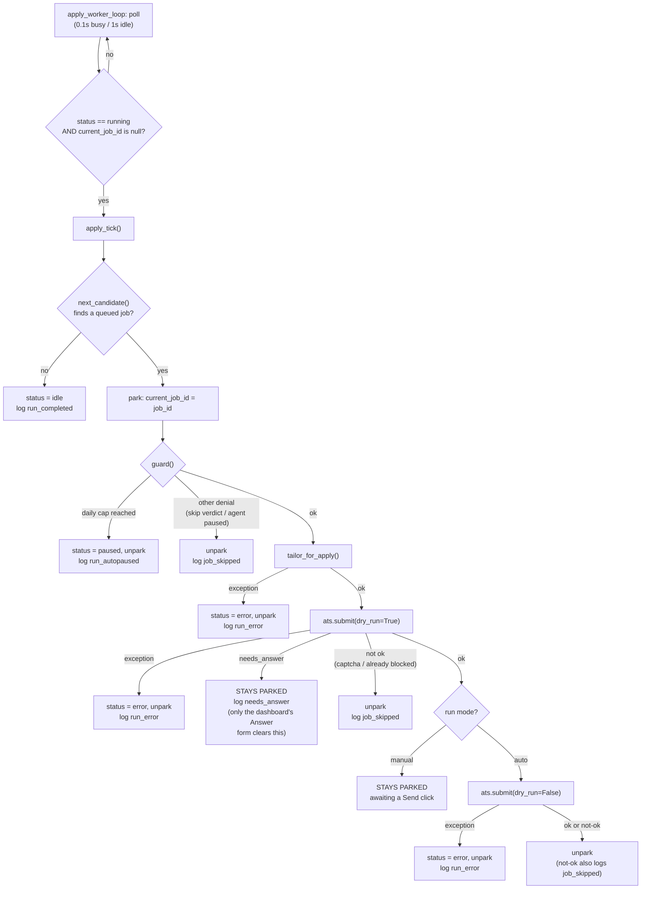
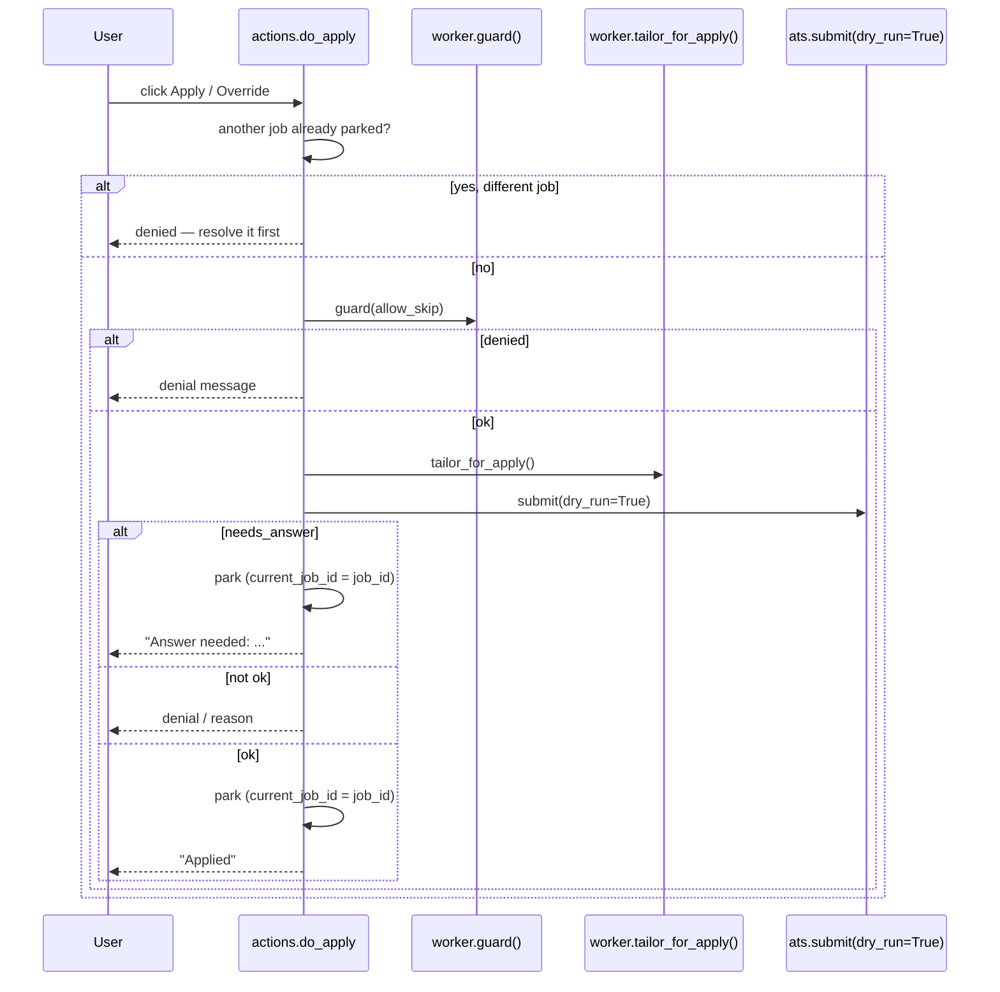
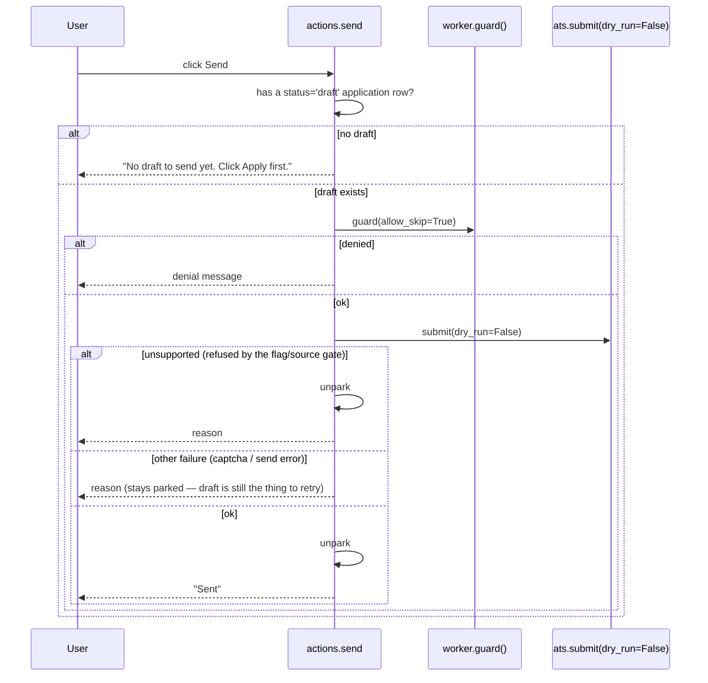

# Automatic apply flow — low-level design

Date: 2026-08-26
Status: as-built reference. Describes current behavior only; no changes are
proposed here. Every claim below is cited to a file and line in `backend/`.

Scope of this document: exactly how a job goes from "sitting in the queue" to
"submitted" (or refused, or parked) — both through the unattended worker loop
and through the dashboard's Apply/Send/Answer buttons. It does **not** cover
discovery, the hard filter, or the scoring gate (`gate.py`) — see
[`2026-08-18-career-agent-v1-design.md`](2026-08-18-career-agent-v1-design.md)
for those.

## Headline finding

**`SUBMISSION_IMPLEMENTED = False`**
(`backend/src/career_agent/apply/ats.py:24`).

With that flag off, a real send (`dry_run=False`) is refused unconditionally
for every job, before anything else runs
(`apply/ats.py:312-321`):

- Any non-Greenhouse job (`job.source != "ats"` — LinkedIn, Naukri) is
  refused **regardless of the flag**. No filler exists for them and none is
  planned; Naukri in particular is discovery-only at every version.
- A Greenhouse job (`job.source == "ats"`) is refused **only** because this
  flag is `False`. The real Greenhouse filler exists and is exercised by
  drafting (see below) — flipping this one constant is the entire remaining
  gap between "drafts correctly" and "actually submits."

**Consequence for the question "does the Apply button actually work":** every
`application` row with `status = 'submitted'` in the database today was
either recorded by hand (`Mark Applied`, `actions.mark_applied`) or happened
outside this system — no code path in this repo can have produced a real
external submission while the flag is `False`. That is the intended,
deliberate behavior of the kill switch this project ships with, not a defect.
See "Verifying it for real" at the end of this document for what changing
that would actually require.

## Two entry points, one shared core

There are two ways a job gets applied to, and they share almost everything:

| | Automatic | Manual (dashboard) |
|---|---|---|
| Trigger | `apply_worker_loop`'s poll, whenever `run_state.status == 'running'` | Apply / Send / Answer buttons on `/applications` |
| Entry function | `worker.apply_tick` (`web/worker.py:99-189`) | `actions.do_apply` / `actions.send` / `actions.answer_question` (`web/actions.py:92-190`) |
| Guard check | `worker.guard()` | same `worker.guard()` |
| Résumé | `worker.tailor_for_apply()` | same `worker.tailor_for_apply()` |
| Actual submit | `apply.ats.submit()` | same `apply.ats.submit()` |
| Parking model | picks its own candidate, parks itself | reacts to what a person clicked; also refuses if a *different* job is already parked (`actions.py:95-102`) — a case `apply_tick` never hits, since it only ever looks for a new candidate while unparked |

Both paths converge on one truth: nothing is submitted for real unless
`ats.submit(dry_run=False)` is reached, and that function's own gate
(above) is what actually decides whether anything leaves this machine.

## The automatic path: `apply_tick`

Step-by-step, with citations:

1. **`apply_worker_loop`** (`web/worker.py:192-211`) polls forever on a fresh
   connection each iteration. It only calls `apply_tick` when
   `run_state.status == 'running'` **and** `current_job_id IS NULL`; otherwise
   it just sleeps (1s) and checks again. Busy iterations sleep 0.1s.
2. **`apply_tick`** (`worker.py:99-189`) re-checks both of those conditions
   itself (`:106-110`) — belt and suspenders against the loop's own race.
3. **`next_candidate`** (`worker.py:54-55`) runs `CANDIDATE_SQL`
   (`:29-36`), built on the shared `QUEUE_WHERE` predicate (`:14-27`): latest
   assessment verdict in `submit`/`hold`, no live application row in any
   `BLOCKING` status, and the latest application isn't a `draft` either. No
   candidate → `status = 'idle'`, log `run_completed` (`:113-116`).
4. **Park** (`:118-119`) — `current_job_id` is set to the candidate *before*
   guarding or drafting. This is what makes every later branch's "unpark"
   meaningful: the job is claimed the moment it's picked, not once it
   succeeds.
5. **`guard()`** (`:58-81`) checks, in order: job has been scored at all;
   verdict isn't `skip` (unless `allow_skip`, which the auto loop always
   passes); today's `submitted` count against `brief.daily_cap`; the `event`
   table's latest `pause` payload. A cap denial auto-pauses the whole run
   (`:123-125`); any other denial just skips this one job and unparks
   (`:126-129`).
6. **`tailor_for_apply()`** (`:84-96`) verifies auth, then reuses or renders a
   résumé via `tailor.ensure_tailored`. An exception here is an `error` state,
   not a skip — it's treated as infrastructure failure, not "this job doesn't
   qualify" (`:131-137`).
7. **Draft submit** — `ats.submit(dry_run=True)` (`:149-157`). This is the
   first point real form-reading happens (see [`ats.submit()` internals](#atssubmit-internals-the-draftsend-split)
   below). Three outcomes matter:
   - `needs_answer` (`:159-166`): logs the event and **returns with
     `current_job_id` still set** — the loop's outer check
     (`current_job_id is None`) now blocks *every* future tick, not just this
     job, until a human answers via the dashboard.
   - not ok (`:168-171`): logged and unparked — the run moves on.
   - ok, but `mode == 'manual'` (`:173-174`): stays parked, waiting for a
     `Send` click. This is the only branch where "drafted successfully" does
     not immediately continue.
8. **Real submit** (auto mode only, `:176-189`) — `ats.submit(dry_run=False)`,
   reusing the résumé version just drafted. Whatever the result, the job is
   unparked afterward; a failure is logged, not raised.

## The manual (dashboard) path

Three independent actions, all in `web/actions.py`, all reusing `guard()` and
`tailor_for_apply()` from `web/worker.py`:

`do_apply` (`actions.py:92-142`) is `apply_tick`'s draft half, triggered by a
click instead of the loop's own pick. It additionally refuses outright if a
*different* job is already parked (`:95-102`) — a case that can't happen in
the automatic loop, since it only ever selects a new candidate while unparked.
It explicitly parks on both the `needs_answer` outcome and on success
(`:126-135`) — `apply_tick` gets the same effect for free because it parked
*before* drafting.

`send` (`actions.py:157-190`) requires an existing draft — it never computes
answers itself, it hands the stored draft to `ats.submit(dry_run=False)`
(same reuse behavior as the automatic loop). It only unparks on an
`unsupported` refusal (`:183-188`, the `SUBMISSION_IMPLEMENTED`/source gate
from `ats.py:312-321`) — any other failure (a transient captcha hold, a
filler exception) leaves the job parked, because the draft is still the
thing worth retrying.

`answer_question` (`actions.py:145-154`) is the third leg: it upserts
`qa_bank`, logs `needs_answer_resolved`, and unparks *only if* the currently
parked job matches (`_unpark`, `:26-33`) — this is the only thing in the
entire system that clears a `needs_answer` park, whether it was set by the
automatic loop or by `do_apply`.

## `ats.submit()` internals: the draft/send split

`apply/ats.py:291-439`. One function, two very different behaviors keyed on
`dry_run`:

- **`dry_run=True` (draft)** (`:335-353`) — reads the live form
  (`_default_compute_answers` for Greenhouse, `_generic_stub_compute_answers`
  for everything else — see below), resolves every custom question through
  `resolve_answers`, and on success **writes an `application` row with
  `status='draft'`** holding the computed answers as JSON. Never clicks
  Submit. A `CaptchaEncountered` writes a `captcha_held` event and returns
  `held: True` with no DB row; a `NeedsAnswer` returns `needs_answer` with no
  DB row either.
- **`dry_run=False` (real send)** (`:355-439`) — looks up the most recent
  `draft` row for this job and **reuses its stored `answers` verbatim**
  (`:361-374`), deliberately *not* re-checking `qa_bank`'s 30-day volatility
  window even if the draft has gone stale — the comment at `:366-373` calls
  this out explicitly: re-validating here would silently send different
  answers than what was drafted/reviewed, which defeats the entire point of
  drafting first. It inserts an `in_flight` row *before* calling the filler
  (`:405-409`, so a crash mid-send is at least visible as `in_flight` rather
  than nothing), then calls `_default_fill_and_submit` (or an injected
  override). Success → `submitted`; a captcha mid-send deletes the
  `in_flight` row entirely (`:413-419`, so it doesn't count as a failed
  attempt); any other exception increments a failure count and becomes
  `failed` or, at 3 failures (`MAX_ATTEMPTS`, `:15`), `failed_permanent`
  (`:420-430`).

Before either branch runs, the unconditional refusal gate
(`:312-321`, the headline finding above) and the `BLOCKING`-status check
(`:323-328` — refuses if this job already has an `in_flight` / `submitted` /
`held_unknown` / `failed_permanent` application) both apply only to real
sends (`dry_run=False`) with no injected test double — drafting is always
allowed to proceed and show you what it would do.

### Playwright shells vs. decision logic

- `resolve_answers` (`:70-89`) is pure — no browser, no I/O beyond the DB.
  Given a form's custom questions, it looks each one up in `qa_bank`
  (`store.qa_lookup`). Missing entirely, or `is_volatile` and last confirmed
  more than `QA_VOLATILE_WINDOW_DAYS = 30` days ago (`:55`, `:58-67`) →
  raises `NeedsAnswer(question)` (`:32-38`, carries only the question text).
  It never touches the facts store — only `qa_bank`.
- `_default_compute_answers` (`:165-210`) is Greenhouse's read-only half:
  loads the page, checks for a captcha, fills standard fields
  (`GREENHOUSE_STANDARD_FIELD_SELECTORS`, `:111-119`) from `CandidateProfile`
  only where the selector actually exists on the page, reads custom
  questions (`_read_custom_questions`, `:128-162`), and calls
  `resolve_answers`. It never clicks anything.
- `_default_fill_and_submit` (`:236-256`) is the write half: fills each
  stored `(locator, value)` via `_fill_field` (`:213-233`, which dispatches
  on the *live* element's tag/type rather than anything recorded at draft
  time, since draft and send are two separate page loads), attaches the
  résumé, clicks the submit button.
- `_generic_stub_compute_answers` (`:259-277`) is what every non-Greenhouse
  source gets: loads the page, checks for a captcha, returns a placeholder —
  it makes no real decisions, matching the unconditional refusal these
  sources get at send time regardless.
- The test-double seam is real: `worker.py` and `actions.py` never pass
  `compute_answers=`/`fill_and_submit=` overrides — those parameters exist
  purely for `tests/test_apply_ats.py`. Production always runs the real
  Playwright functions above; `SUBMISSION_IMPLEMENTED=False` is what actually
  prevents a real send, not test doubles.

### `sweep_stale_in_flight` — exists, but nothing calls it

`ats.py:280-288` flips a stuck `in_flight` row to `held_unknown` after 15
minutes (crash recovery: "true state unknown, so it blocks rather than
allowing a possible double send"). Searching `worker.py`, `actions.py`,
`api.py`, and `app.py` turns up no caller. `app.py`'s `_conn()` does call it
on every request currently (worth re-confirming if this file changes) — but
if that call is ever removed, a crash mid-send would leave a job
`in_flight` indefinitely with nothing to notice.

## The `application.status` state machine

From `db.py:42-57`:

```mermaid
stateDiagram-v2
    [*] --> draft: submit(dry_run=True)
    draft --> in_flight: submit(dry_run=False) begins
    in_flight --> submitted: filler succeeds
    in_flight --> failed: filler throws (attempt 1-2)
    in_flight --> failed_permanent: filler throws (attempt 3, MAX_ATTEMPTS)
    in_flight --> [*]: captcha mid-send (row deleted)
    in_flight --> held_unknown: sweep_stale_in_flight() after 15 min (if ever called)
    failed --> in_flight: actions.queue_retry (requeues; only failed is retryable)
```

`BLOCKING = ("in_flight", "submitted", "held_unknown", "failed_permanent")`
(`ats.py:16`) is the set that refuses a second application for the same job —
enforced twice: once as a query filter in `ats.submit`
(`:323-328`) and once as a real DB constraint, the partial unique index
`one_live_application_per_job` (`db.py:55-57`). `worker.QUEUE_WHERE`
(`worker.py:14-27`) also encodes the same four values inline, as a literal
SQL list rather than importing `BLOCKING` — if that tuple ever changes, this
is a second place that must change with it.

Note `failed` alone is **not** in `BLOCKING` — it's the one status
`actions.queue_retry` (`actions.py:270-284`) will accept, precisely so a
transient failure can be requeued instead of stuck forever.

## Verifying it for real

The question that prompted this document — "does Apply actually work" —
can't be answered by reading code alone once you get past the flag: drafting
against a real Greenhouse posting exercises the real filler today (the flag
only blocks the *send* half), so the safe way to build confidence is:

1. Click Apply (not Send) on a few real Greenhouse jobs in the queue. This
   runs the real `_default_compute_answers` and shows you exactly what it
   read and decided, with zero risk — the flag isn't even consulted for a
   draft.
2. Compare what it drafted against the actual page — this is exactly what
   the README's "Real Greenhouse submission (v3)" section already asks you
   to do before ever flipping `SUBMISSION_IMPLEMENTED`, and it's the
   intended way to build trust in the selectors called out as unverified
   (`ats.py:101-110`).
3. Only flipping `SUBMISSION_IMPLEMENTED = True` (by hand, after that
   verification) would ever cause a real external submission. That's a
   separate, deliberately manual decision this document does not make for
   you.
